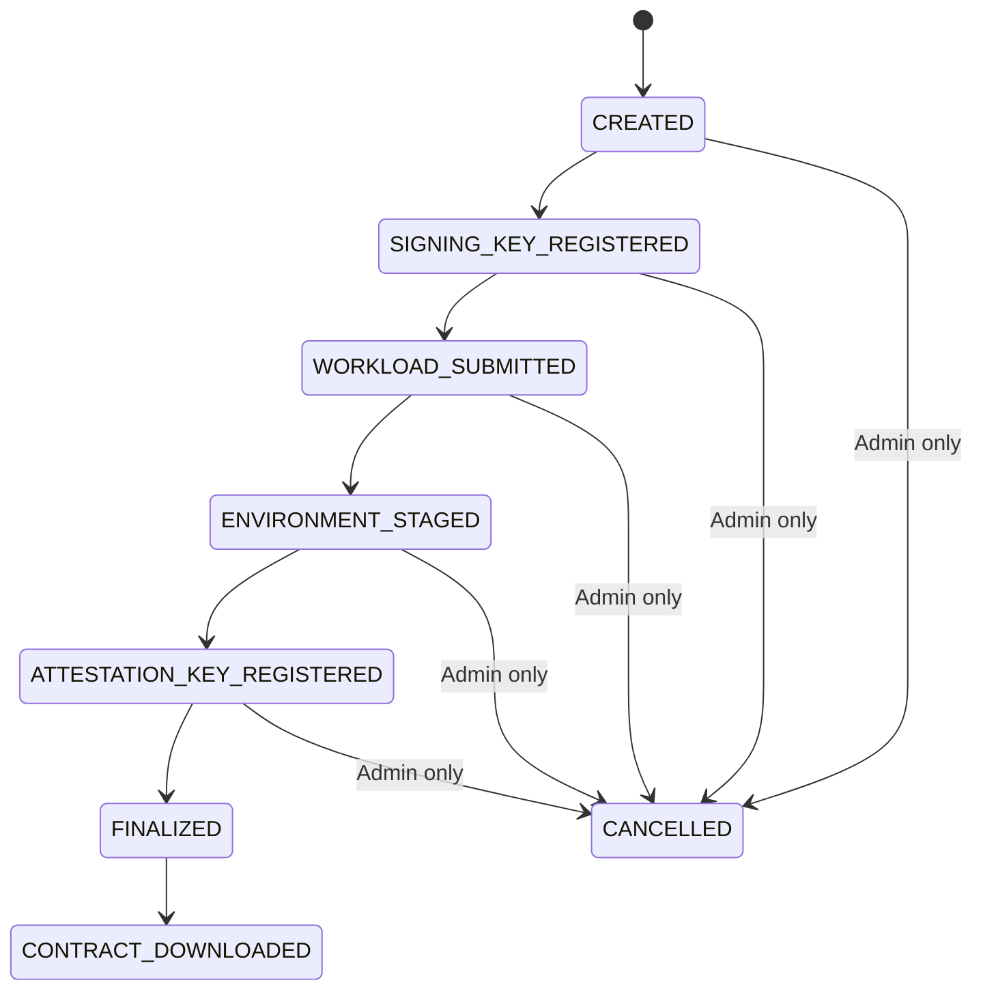
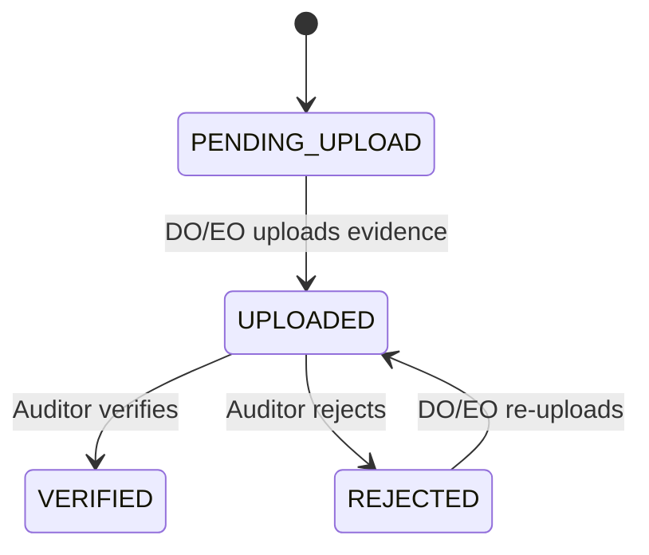
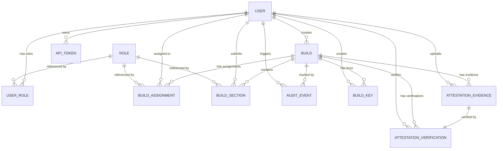

# IBM Confidential Computing Contract Generator — High-Level Design (HLD)

> **Version:** 0.6  
> **Date:** 2026-04-18  
> **Status:** Draft

---

## 1. Introduction

The IBM Confidential Computing Contract Generator is a self-hosted, open-source system that enables organizations to collaboratively construct, sign, and finalize encrypted userdata contracts (YAML format) for **HPCR**, **HPCR4RHVS**, and **HPCC** deployments.

The system enforces a strict, linear, multi-persona workflow with cryptographic identity binding. Each persona registers an RSA public key at account creation and contributes exactly once per build. Builds require explicit user-to-role assignments, ensuring accountability. Once finalized, the contract becomes immutable.

### Architectural Principles

- **Contract cryptography** (section encryption, contract assembly, signing) is performed by the **Go backend** using the native `contract-go` engine.
- **Identity cryptography** (user key generation, request signing) remains client-side on the **Electron desktop application** (React + IBM Carbon UI).
- Build-scoped signing and attestation keys are managed by **HashiCorp Vault**. For HPCR operations that require private keys, the backend performs just-in-time key retrieval into process memory and zeroizes memory after use; private keys are never persisted outside Vault.
- The backend orchestrates workflow, verifies signatures against **registered public keys**, stores encrypted artifacts, and maintains an audit hash chain.
- Every user registers a public key; the corresponding identity private key **never** leaves the user's machine.
- Build participation requires explicit assignment — having the correct role alone is insufficient.
- The final artifact is a signed and encrypted YAML contract file.

> **Note:** The v1 workflow (client-side encryption via `contract-cli`) is deprecated. V2 endpoints perform all contract cryptography server-side. V1 endpoints remain available for backward compatibility.

---

## 2. Goals & Non-Goals

### Goals

- Enforce separation of duties across personas
- Bind cryptographic identity to user accounts via public key registration
- Ensure strict linear state progression
- Maintain cryptographic audit trail with identity-bound signatures
- Keep identity private keys client-side while keeping build private keys under Vault-governed backend custody
- Protect sensitive data at every stage with cryptographic guarantees (not just RBAC)
- Produce immutable final YAML contract
- Support LAN and internet deployments
- Fully open-source stack

### Non-Goals

- Multi-tenant SaaS
- Real-time collaboration
- HPCR orchestration

---

## 3. System Context

### Customer Environment

```
[ Electron Desktop App ]  <--HTTPS-->  [ nginx Reverse Proxy ]
                                              |
                                              v
                                        [ Go Backend ]
                                           /      \
                                          v        v
                                   [ PostgreSQL ] [ HashiCorp Vault ]
```

### Deployment Target

```
[ HPCR Instance ]  <-- receives YAML userdata file
```

### Key Points

- nginx is **mandatory** for TLS termination.
- Backend is never directly internet-exposed.
- **Contract cryptography** (section encryption, assembly, signing) is performed server-side via `contract-go`.
- **Identity cryptography** (user key generation, request signing) remains client-side.
- Build-scoped signing and attestation keys are managed in **HashiCorp Vault**. HPCR-required private key usage happens only as short-lived in-memory material inside backend workers.
- Backend stores only encrypted or hashed data.
- Backend verifies signatures against registered public keys — never against request-supplied keys.

### Desktop Application Architecture

The Electron desktop application is the primary client interface for all users. It enforces client-side cryptography and provides a secure, user-friendly interface built with React and IBM Carbon Design System.

**Key Features:**

1. **Security-First Design**
   - Identity cryptographic operations (key generation, request signing) execute in the Electron main process (Node.js)
   - Contract cryptography (encryption, assembly, signing) delegated to backend via v2 API
   - Renderer process (React UI) has no direct access to crypto APIs
   - Context isolation and sandbox mode enabled
   - Secure IPC communication via preload script
   - Identity private keys never leave the user's machine

2. **User Interface**
   - IBM Carbon Design System for consistent, professional UI
   - Dark mode (g100) as default theme
   - Custom frameless window with branded title bar
   - Role-based navigation and access control
   - Boot screen with progressive loading
   - Split-screen login with feature showcase

3. **State Management**
   - Zustand for lightweight, performant state management
   - Persistent storage for auth tokens and configuration
   - Session-only storage for sensitive build data
   - Automatic cleanup on logout and app close

4. **Key Views**
   - **Home Dashboard**: Account overview, system alerts, build actions
   - **Build Management**: Create, view, and manage contract builds
   - **Build Details**: Section-by-section signing and status tracking
   - **User Management**: CRUD operations, role assignment (Admin only)
   - **Admin Analytics**: System diagnostics, security monitoring (Admin only)
   - **System Logs**: Comprehensive audit trail with search and export (Admin/Auditor)
   - **Account Settings**: Profile, password, and key management
   - **Login**: Split-screen with server configuration and remember email

5. **Cryptographic Operations (Client-Side)**
   - RSA-4096 key pair generation (identity keys)
   - SHA-256 hashing
   - RSA-PSS signing (request signing, audit signatures)
   - Secure key storage per user ID

6. **Production Distribution**
   - Cross-platform builds (macOS, Windows, Linux)
   - Code signing support for trusted distribution
   - Signed installer/distribution artifacts with manual update rollout
   - Installer and portable versions
   - Comprehensive build documentation
   - No external CLI dependencies required (contract-cli removed)


---

## 4. Personas & Responsibilities

### Account Setup (First Login)

When a user is created (by Admin or seeded at deployment), they receive an initial password. On first login, the Electron desktop app enforces a **mandatory setup flow** before the user can access any functionality:

1. **Change password** — user must replace the admin-assigned initial password.
2. **Generate RSA-4096 key pair** locally on the desktop application.
3. **Register public key** with the backend.

Until setup is complete, the backend restricts the token to setup-only endpoints (password change, public key registration, logout). All other endpoints return `403 Account setup incomplete`.

> The seeded Admin user (created from `ADMIN_EMAIL`/`ADMIN_PASSWORD` env vars at deployment) follows the same setup flow on first login.

---

### Public Key Registration & Expiry

Every user registers an RSA-4096 **public key** with their profile. The private key never leaves the user's machine.

Public keys currently expire after **90 days**. When a key expires:
- The user is blocked from participating in builds until they register a new key.
- The auth middleware treats an expired key similarly to a missing key — setup-only endpoints are accessible.
- Previous signatures made with the old key remain valid for audit verification (the fingerprint in audit events references the key used at the time).

This enables:

- **Identity-bound signature verification** — the backend verifies all signatures against the user's registered public key, not a request-supplied key.
- **Non-repudiation for mutating actions** — each actor signs requests with their identity private key, and backend verifies against registered public keys.
- **Key rotation** — expired keys force users to generate fresh key pairs, limiting the impact of a compromised private key.

---

### Credential Rotation Policy

The backend enforces periodic credential rotation:

| Credential | Rotation Interval | Mechanism |
|---|---|---|
| **Password** | Every 90 days | Backend marks expired credentials via rotation checks; user is forced into setup flow on next login. |
| **Public Key** | Every 90 days | Backend checks `public_key_expires_at`. Expired keys block build participation until a new key is registered. |

In the current implementation, the 90-day window is encoded in DB/query logic and rotation checks.

---

### Build Assignments

When a build is created, the Admin **assigns specific users** to each persona role for that build. Only the assigned user can act in that role. This provides two layers of access control:

1. **Role-based:** User must have the correct persona role.
2. **Assignment-based:** User must be explicitly assigned to this specific build.

---

### Auditor — Phase 1: Signing Key Registration

> Occurs **before** SP and DO submit their sections. The signing key is needed for later contract signing.

| | |
|---|---|
| **Provides** | Signing key (generated in Vault or uploaded) |
| **V2 Actions** | Register signing key via `POST /builds/{id}/keys/signing`. Vault manages the RSA-4096 key pair and returns public key + key ID. Private key material is retrievable only by backend at runtime for HPCR operations and is never persisted to DB/files/logs. |

---

### Solution Provider

| | |
|---|---|
| **Provides** | Workload section payload |
| **V2 Actions** | Submit plaintext workload + HPCR encryption certificate to backend via `POST /builds/{id}/v2/sections/workload`. Backend encrypts using `contract-go`. |
| **V1 Actions (deprecated)** | Encrypt workload using `contract-cli` locally, compute SHA256 hash, sign hash with private key, upload via `POST /builds/{id}/sections` |

**Notes:**

- In the v2 flow, the backend handles encryption and hash computation.
- Section `signature`/`section_hash` are persisted with the section row.
- Mutating request signature headers (`X-Signature*`) are verified against the actor's registered public key.

---

### Data Owner

| | |
|---|---|
| **Provides** | Environment section payload (logging credentials, secrets, env vars) |
| **V2 Actions** | Submit plaintext environment + HPCR encryption certificate via `POST /builds/{id}/v2/sections/environment`. Backend encrypts using `contract-go` and stores encrypted payload + section hash. |
| **V1 Actions (deprecated)** | Encrypt environment locally, wrap symmetric key, and submit via `POST /builds/{id}/sections`. |

**Notes:**

- Signing key setup is already completed earlier (`SIGNING_KEY_REGISTERED`) by the Auditor.
- In v2, Data Owner no longer performs local env encryption/wrapping/signing for contract payloads.
- Mutating request signature headers (`X-Signature*`) are still required and verified against the Data Owner's registered identity public key.

---

### Auditor — Phase 2: Attestation Key Registration

> Occurs **after** SP and DO have submitted their sections, **before** finalization.

| | |
|---|---|
| **Provides** | Attestation public key |
| **V2 Actions** | Register attestation key via `POST /builds/{id}/keys/attestation` — mode `generate` (Vault-managed RSA-4096 key pair, enabling backend-side HPCR attestation decryption/verification) or `upload_public` (Auditor provides externally generated public key). |

---

### Auditor — Phase 3: Contract Finalization

| | |
|---|---|
| **Provides** | Final assembled contract (backend-driven) |

**V2 Actions (Backend-Native):**

1. Trigger finalization via `POST /builds/{id}/v2/finalize` with `signing_key_id`, optional `attestation_key_id`, and optional `attestation_cert_pem`.
2. Backend loads encrypted sections, resolves keys from Vault, computes `envWorkloadSignature` and `contract_hash` signatures using `HpcrContractSign(...)`, assembles deterministic YAML, and transitions build to FINALIZED.

**V1 Actions (Deprecated — Local contract-cli):**

1. Generate keys locally, download sections, unwrap/decrypt, inject signing cert.
2. Encrypt via `contract-cli`, assemble contract, compute hash, sign, upload.

**Backend Actions (V2):**

- Verifies the Auditor is the assigned user for this build.
- Encrypts attestation public key using HPCR certificate (if provided).
- Signs `envWorkloadSignature` and `contractHash` using `HpcrContractSign(...)` with Vault-fetched private key material loaded transiently into backend memory.
- Assembles deterministic YAML contract.
- Stores `contract_yaml` and marks build as **FINALIZED** with `is_immutable = true`.
- Emits audit event.

**Backend Actions (V1 — deprecated):**

- Verifies signature against the Auditor's **registered public key**.
- Stores `contract_yaml`, marks build as FINALIZED.
- Emits audit event.

---

### Env Operator

| | |
|---|---|
| **Provides** | Download acknowledgment (signed receipt) |

**Local Actions:**

1. Download finalized YAML contract from backend (`/export` or `/userdata`).
2. Electron desktop app handles both raw YAML and legacy base64 values (for backward compatibility) and writes raw YAML locally.
3. Compute `SHA256(contract.yaml)` locally and verify it matches the build's `contract_hash`.
4. Sign the `contract_hash` with the Env Operator's **registered identity private key**.
5. Upload signed acknowledgment to backend.
6. Deploy the decoded YAML to the HPCR instance.

**Backend Actions:**

- Verifies the Env Operator is the assigned user for this build.
- Verifies signature against the Env Operator's **registered public key**.
- Emits `CONTRACT_DOWNLOADED` audit event with signature.

> This creates a cryptographic proof-of-receipt: the audit chain records that the assigned Env Operator downloaded and verified the correct contract.

---

### Post-Finalization: Attestation Evidence Upload

| | |
|---|---|
| **Who** | Data Owner or Env Operator (assigned) |
| **Provides** | Encrypted attestation records file + signature file |
| **Actions** | Upload evidence via `POST /builds/{id}/attestation/evidence` using signed `application/json` (desktop-preferred) or `multipart/form-data`. Desktop unlocks this action after download acknowledgment (`CONTRACT_DOWNLOADED`). Backend stores evidence blobs and updates `attestation_state` to `UPLOADED`. |

---

### Post-Finalization: Attestation Verification

| | |
|---|---|
| **Who** | Auditor (assigned) |
| **Provides** | Verification verdict |
| **Actions** | Trigger verification via `POST /builds/{id}/attestation/evidence/{evidence_id}/verify` (optional `attestation_key_passphrase` when attestation private key material is encrypted). Backend retrieves attestation private key material from Vault at runtime, decrypts records via `HpcrGetAttestationRecords(...)`, then verifies signature via `HpcrVerifySignatureAttestationRecords(...)`. Returns verdict (`VERIFIED` or `REJECTED`), and rejected outcomes include the contract-go verification error reason. |

---

### Admin

| | |
|---|---|
| **Provides** | Signed build + assignment operations, user management |

**Build Creation (Local Actions):**

1. Compose build metadata (build name).
2. Compute `SHA256(canonical_json(build_create_request))` locally.
3. Sign the canonical request hash with the Admin's **registered identity private key**.
4. Create the build via `POST /builds`.
5. Assign personas with separate signed calls to `POST /builds/{id}/assignments` (one per workflow role).

**Backend Actions:**

- Verifies each mutating request signature against the Admin's **registered public key**.
- Creates the build (`POST /builds`) and records a `BUILD_CREATED` audit event.
- Processes assignment calls (`POST /builds/{id}/assignments`) with role/assignment validation and emits `ROLE_ASSIGNED` audit events.

**Other Admin responsibilities:**

- Creates users (triggers public key registration on client)
- Cancels pre-finalized builds
- Manages user roles

---

### Viewer

- Read-only access to builds and audit logs.

---

## 5. Build Lifecycle



**Post-finalization attestation lifecycle** (tracked by `attestation_state`, not the build state machine):



### Invariants

- Strict linear progression for the build state machine.
- Auditor registers signing key **before** SP/DO submit sections.
- Auditor registers attestation key **after** sections, **before** finalization.
- Build participation requires both correct role **and** explicit assignment.
- No concurrent edits.
- **FINALIZED**, **CONTRACT_DOWNLOADED**, and **CANCELLED** are immutable end states for workflow mutations.
- The only allowed post-finalization state change is the download acknowledgment path (`FINALIZED -> CONTRACT_DOWNLOADED`).
- Attestation evidence upload and verification are post-finalization operations tracked by `attestation_state`.
- Desktop unlocks attestation evidence upload only after the build reaches `CONTRACT_DOWNLOADED`.
- In the v2 flow, contract assembly is performed by the backend using the `contract-go` engine.
- Signatures are verified against registered public keys, never request-supplied keys.
- In v2, backend encrypts environment payload server-side; plaintext is processed in-request and only encrypted artifacts are persisted.

---

## 6. Core Domain Model

### How the Tables Connect

The domain model consists of 11 entities. Here's how they relate:



**Reading the model:**

- **User** — A person using the system. Carries their identity (password, public key) and links to everything they do.
- **Role** — A reference table of persona types (seeded at deployment). Not an ENUM — it's a first-class table so all other tables reference it via foreign key.
- **User Role** — Junction table: "User X has role Y, assigned by Admin Z." A user can have multiple roles.
- **Build** — A contract being collaboratively constructed. Tracks current lifecycle status and eventually holds the final contract YAML/hash (raw YAML in current flow; legacy rows may be base64). `encryption_certificate` exists as an optional compatibility field.
- **Build Assignment** — "For Build B, role Y is performed by User X." This is how the Admin binds specific users to specific builds. One user per role per build.
- **Build Section** — Encrypted data submitted by a persona during the build. Current flow stores up to 3 role sections (Solution Provider, Data Owner, Auditor), each with encrypted payload, hash, and signature metadata.
- **Build Key** — Build-scoped signing or attestation key. Managed in Vault (or uploaded). Public key + vault reference are stored; private key material is only retrieved transiently by backend for HPCR-required operations.
- **Attestation Evidence** — Records + signature files uploaded by Data Owner or Env Operator for post-finalization attestation verification.
- **Attestation Verification** — Auditor-triggered verification result (VERIFIED or REJECTED) with details.
- **Audit Event** — A tamper-evident log entry. Each event hashes its data together with the previous event's hash, forming an unbreakable chain. Signed by the actor's registered key.
- **API Token** — Bearer tokens for authentication. Stored as SHA-256 hashes (never plaintext), revocable, and evaluated against configured token TTL from creation time.

### User

| Field | Type |
|---|---|
| `id` | UUID |
| `name` | string |
| `email` | string |
| `password_hash` | string |
| `must_change_password` | bool (default: true) |
| `password_changed_at` | timestamp |
| `public_key` | text (nullable) |
| `public_key_fingerprint` | string (nullable) |
| `public_key_registered_at` | timestamp (nullable) |
| `public_key_expires_at` | timestamp (nullable) |
| `is_active` | bool |
| `created_at` | timestamp |
| `updated_at` | timestamp |

### Role

| Field | Type |
|---|---|
| `id` | UUID |
| `name` | string (unique) |
| `description` | text |
| `created_at` | timestamp |
| `updated_at` | timestamp |

> Roles are a reference table seeded at deployment: `SOLUTION_PROVIDER`, `DATA_OWNER`, `AUDITOR`, `ENV_OPERATOR`, `ADMIN`, `VIEWER`. All other tables reference roles via foreign key.

### User Role

| Field | Type |
|---|---|
| `user_id` | reference → User |
| `role_id` | reference → Role |
| `assigned_by` | reference → User |
| `assigned_at` | timestamp |
| `updated_at` | timestamp |

### Build

| Field | Type |
|---|---|
| `id` | UUID |
| `name` | string |
| `status` | ENUM |
| `created_by` | reference → User |
| `encryption_certificate` | text |
| `created_at` | timestamp |
| `finalized_at` | timestamp |
| `contract_hash` | string |
| `contract_yaml` | text (raw YAML in current flow; backward compatible with legacy base64 rows) |
| `is_immutable` | bool |
| `attestation_state` | ENUM (`PENDING_UPLOAD`, `UPLOADED`, `VERIFIED`, `REJECTED`) |
| `attestation_verified_at` | timestamp (nullable) |
| `attestation_verified_by` | reference → User (nullable) |

### Build Assignment

| Field | Type |
|---|---|
| `id` | UUID |
| `build_id` | reference → Build |
| `role_id` | reference → Role |
| `user_id` | reference → User |
| `assigned_by` | reference → User |
| `assigned_at` | timestamp |

### Build Section

| Field | Type |
|---|---|
| `id` | UUID |
| `build_id` | reference → Build |
| `role_id` | reference → Role |
| `submitted_by` | reference → User |
| `encrypted_payload` | text |
| `wrapped_symmetric_key` | text (nullable, request field alias in UI/API: `encrypted_symmetric_key`) |
| `section_hash` | string |
| `signature` | string |
| `submitted_at` | timestamp |

### Audit Event

| Field | Type |
|---|---|
| `id` | UUID |
| `build_id` | reference (nullable) |
| `sequence_no` | integer |
| `event_type` | ENUM |
| `actor_user_id` | reference |
| `actor_key_fingerprint` | string |
| `ip_address` | string |
| `device_metadata` | JSON |
| `event_data` | JSON |
| `previous_event_hash` | string |
| `event_hash` | string |
| `signature` | string |
| `created_at` | timestamp |

### API Token

| Field | Type |
|---|---|
| `id` | UUID |
| `user_id` | reference |
| `name` | string |
| `token_hash` | string |
| `last_used_at` | timestamp |
| `revoked_at` | timestamp (nullable) |
| `created_at` | timestamp |

> Token validity is derived at runtime from `created_at + TOKEN_EXPIRY`; there is no persisted `expires_at` column.

### Build Key

| Field | Type |
|---|---|
| `id` | UUID |
| `build_id` | reference → Build |
| `key_type` | ENUM (`SIGNING`, `ATTESTATION`) |
| `mode` | ENUM (`generate`, `upload_public`) |
| `status` | ENUM (`ACTIVE`, `REVOKED`) |
| `vault_ref` | string (nullable — Vault key reference/path) |
| `public_key` | text |
| `public_key_fingerprint` | string |
| `created_by` | reference → User |
| `created_at` | timestamp |

### Attestation Evidence

| Field | Type |
|---|---|
| `id` | UUID |
| `build_id` | reference → Build |
| `uploaded_by` | reference → User |
| `uploader_role` | persona_role |
| `records_file_name` | string |
| `records_content` | bytea |
| `signature_file_name` | string |
| `signature_content` | bytea |
| `metadata` | JSONB |
| `created_at` | timestamp |

### Attestation Verification

| Field | Type |
|---|---|
| `id` | UUID |
| `build_id` | reference → Build |
| `evidence_id` | reference → Attestation Evidence (unique) |
| `verified_by` | reference → User |
| `verdict` | ENUM (`VERIFIED`, `REJECTED`) |
| `details` | JSONB |
| `created_at` | timestamp |

---

## 7. Cryptographic Standards

| Operation | Standard |
|---|---|
| **Asymmetric Keys** | RSA 4096-bit |
| **Signing** | RSA-PSS with SHA-256 (PKCS#1 v2.1) |
| **Symmetric Encryption** | AES-256-GCM |
| **Key Wrapping** | RSA-OAEP with SHA-256 |
| **Hashing** | SHA-256 |
| **Encoding** | Base64 (standard, with padding) for all binary payloads |
| **Certificates** | X.509v3 PEM |
| **Canonical JSON** | RFC 8785 (JSON Canonicalization Scheme) |
| **Contract-go Envelope** | `contract-go.v1.<base64-json>` (algorithm, wrapped_key, nonce, ciphertext) |
| **Key Management** | HashiCorp Vault-managed build keys (RSA-4096) with just-in-time backend memory retrieval for HPCR sign/decrypt operations |

---

## 8. Audit Hash Chain

### What is the Audit Hash Chain?

Every significant action in the system (build creation, section submission, finalization, download) produces an **audit event**. These events are linked together in a **hash chain** — each event's hash incorporates the previous event's hash, forming a tamper-evident log. If any event is modified, deleted, or reordered, the chain breaks and verification fails.

### Who Signs What?

The current implementation validates signatures in three ways:

1. **Signed stage events in audit chain (required):**
| Event | Persona | Step |
|---|---|---|
| `BUILD_CREATED` | Admin | 0 |
| `SIGNING_KEY_REGISTERED` | Auditor | 1 |
| `WORKLOAD_SUBMITTED` | Solution Provider | 2 |
| `ENVIRONMENT_STAGED` | Data Owner | 3 |
| `ATTESTATION_KEY_REGISTERED` | Auditor | 4 |
| `BUILD_FINALIZED` | Auditor | 5 |
| `CONTRACT_DOWNLOADED` | Env Operator | 6 |
| `ATTESTATION_EVIDENCE_UPLOADED` | Data Owner / Env Operator | 7 (post-finalization) |
| `ATTESTATION_VERIFIED` | Auditor | 8 (post-finalization) |

2. **Request-signature metadata captured on mutating calls (when applicable):**
| Event | Source |
|---|---|
| `BUILD_CREATED` | signed mutating request headers |
| `ROLE_ASSIGNED` | signed mutating request headers |

3. **Section payload signatures in `build_sections`:**
| Field | Purpose |
|---|---|
| `section_hash` + `signature` | persona-level cryptographic proof of submitted section payload |

### How the Chain Works

```mermaid
flowchart LR
    S["Seed: SHA256('IBM_CC:' + build_id)"] --> E0
    E0["Event 0: BUILD_CREATED\nhash = SHA256(data + seed)"] --> E1
    E1["Event 1: SIGNING_KEY_REGISTERED\nhash = SHA256(data + E0.hash)"] --> E2
    E2["Event 2: WORKLOAD_SUBMITTED\nhash = SHA256(data + E1.hash)"] --> E3
    E3["Event 3: ENVIRONMENT_STAGED\nhash = SHA256(data + E2.hash)"] --> E4
    E4["Event 4: ATTESTATION_KEY_REGISTERED\nhash = SHA256(data + E3.hash)"] --> E5
    E5["Event 5: BUILD_FINALIZED\nhash = SHA256(data + E4.hash)"] --> E6
    E6["Event 6: CONTRACT_DOWNLOADED\nhash = SHA256(data + E5.hash)"] --> E7
    E7["Event 7: ATTESTATION_EVIDENCE_UPLOADED\nhash = SHA256(data + E6.hash)"] --> E8
    E8["Event 8: ATTESTATION_VERIFIED\nhash = SHA256(data + E7.hash)"]
```



### Step-by-Step Example

**Step 1 — Genesis (Seed Hash):**  
When a build is created, the chain starts with a deterministic seed:
```
seed = SHA256("IBM_CC:" + build_id)
     = SHA256("IBM_CC:550e8400-e29b-41d4-a716-446655440000")
     = "a1b2c3d4..."
```

**Step 2 — First Event (BUILD_CREATED):**  
The Admin creates the build. The event data is serialized to canonical JSON (RFC 8785), then hashed together with the seed:
```
event_data = {
    "actor_id": "admin-uuid",
    "actor_key_fingerprint": "abc123...",
    "build_id": "550e8400...",
    "details": { "name": "prod-v2.1" },
    "event_type": "BUILD_CREATED",
    "timestamp": "2026-04-05T10:00:00Z"
}

previous_event_hash = "a1b2c3d4..."  (the seed)
event_hash = SHA256(canonical_json(event_data) + previous_event_hash)
           = "e5f6g7h8..."
signature  = RSA-PSS-Sign(event_hash, admin_private_key)
```

**Step 3 — Subsequent Events:**  
Each subsequent event uses the previous event's hash as its `previous_event_hash`, creating the chain:
```
Event 1 (SIGNING_KEY_REGISTERED):
    previous_event_hash = "e5f6g7h8..."  (Event 0's hash)
    event_hash = SHA256(canonical_json(event_data) + "e5f6g7h8...")
    signature  = RSA-PSS-Sign(event_hash, auditor_private_key)

Event 2 (WORKLOAD_SUBMITTED):
    previous_event_hash = "i9j0k1l2..."  (Event 1's hash)
    event_hash = SHA256(canonical_json(event_data) + "i9j0k1l2...")
    signature  = RSA-PSS-Sign(event_hash, sp_private_key)

  ... and so on through Events 3–8
```

### Why This Matters

- **Tamper detection:** If anyone modifies an event's data, its hash changes, which breaks the chain from that point forward.
- **Non-repudiation:** Each event is signed by the actor's registered private key. The actor cannot deny performing the action.
- **Accountability:** Every persona's contribution is cryptographically bound to their identity.
- **No loose ends:** Admin signs build creation, Auditor signs key registration + finalization + attestation verification, SP/DO sign section payloads, Env Operator signs download acknowledgment, DO/EO signs attestation evidence upload.
- **Post-finalization integrity:** Attestation upload and verification events extend the chain beyond finalization, ensuring the attestation lifecycle is tamper-evident.

### Verification

The `GET /builds/{id}/verify` endpoint:

1. Recomputes the seed from the build ID.
2. Walks each event in order, recomputing hashes.
3. Verifies each event's hash matches the stored hash.
4. Verifies each signature against the actor's **registered public key** (looked up via `actor_key_fingerprint`).
5. Validates that the contract hash in the `BUILD_FINALIZED` event matches the stored contract.
6. Returns a pass/fail report with details of any broken links.

---

## 9. API Surface

### Platform & Docs

| Method | Endpoint |
|---|---|
| `GET` | `/health` |
| `GET` | `/openapi.json` |
| `GET` | `/swagger` |

### Auth & Role Discovery

| Method | Endpoint |
|---|---|
| `POST` | `/auth/login` |
| `POST` | `/auth/logout` |
| `GET` | `/roles` |

### User Management

| Method | Endpoint |
|---|---|
| `GET` | `/users` |
| `POST` | `/users` |
| `PATCH` | `/users/{id}` |
| `PATCH` | `/users/{id}/roles` |
| `DELETE` | `/users/{id}` |
| `PATCH` | `/users/{id}/reactivate` |
| `PATCH` | `/users/{id}/reset-password` |
| `PUT` | `/users/{id}/public-key` |
| `GET` | `/users/{id}/public-key` |
| `PATCH` | `/users/{id}/password` |
| `GET` | `/users/{id}/tokens` |
| `POST` | `/users/{id}/tokens` |
| `DELETE` | `/users/{id}/tokens/{token_id}` |
| `GET` | `/users/{id}/assignments` |

### Build Lifecycle & Data

| Method | Endpoint |
|---|---|
| `GET` | `/builds` |
| `POST` | `/builds` |
| `GET` | `/builds/{id}` |
| `PATCH` | `/builds/{id}/status` |
| `POST` | `/builds/{id}/attestation` |
| `POST` | `/builds/{id}/finalize` |
| `POST` | `/builds/{id}/cancel` |
| `GET` | `/builds/{id}/sections` |
| `POST` | `/builds/{id}/sections` |
| `GET` | `/builds/{id}/assignments` |
| `POST` | `/builds/{id}/assignments` |
| `DELETE` | `/builds/{id}/assignments` |

### V2: Backend-Native Key Management

| Method | Endpoint |
|---|---|
| `POST` | `/builds/{id}/keys/signing` |
| `POST` | `/builds/{id}/keys/attestation` |
| `GET` | `/builds/{id}/keys/signing/public` |

### V2: Backend-Native Contract Operations

| Method | Endpoint |
|---|---|
| `POST` | `/builds/{id}/v2/sections/workload` |
| `POST` | `/builds/{id}/v2/sections/environment` |
| `POST` | `/builds/{id}/v2/finalize` |

### V2: Attestation Evidence

| Method | Endpoint |
|---|---|
| `POST` | `/builds/{id}/attestation/evidence` |
| `POST` | `/builds/{id}/attestation/evidence/{evidence_id}/verify` |
| `GET` | `/builds/{id}/attestation/status` |

- Upload endpoint accepts either signed JSON payloads or `multipart/form-data`.
- Verify endpoint accepts optional `attestation_key_passphrase` for encrypted attestation private keys.

### Audit, Verification, and Export

| Method | Endpoint |
|---|---|
| `GET` | `/builds/{id}/audit` |
| `GET` | `/builds/{id}/audit-trail` |
| `GET` | `/builds/{id}/verify` |
| `GET` | `/builds/{id}/verify-contract` |
| `GET` | `/builds/{id}/export` |
| `GET` | `/builds/{id}/userdata` |
| `POST` | `/builds/{id}/acknowledge-download` |

### Admin Operations

| Method | Endpoint |
|---|---|
| `GET` | `/system-logs` |
| `GET` | `/rotation/expired` |
| `POST` | `/rotation/force-password-change/{user_id}` |
| `POST` | `/rotation/revoke-key/{user_id}` |

---

## 10. System Architecture

### Reverse Proxy (Mandatory: nginx)

**Responsibilities:**

- TLS 1.3 termination
- Rate limiting
- Request body size limits
- Security headers
- Optional IP allowlisting

### Backend (Go)

**Components:**

- HTTP Layer
- `BuildService` (state machine enforcement + assignment checks)
- `ContractService` (v2 section encryption + finalization via `contract-go`)
- `KeyService` (build-scoped key lifecycle via `KeyProvider`)
- `AttestationService` (evidence upload + cryptographic verification)
- `AuditService`
- `VerificationService`
- `ExportService`
- `UserService`
- `KeyProvider` interface (Vault or Mock implementations)
- `contract.Engine` interface (`contractgo.Engine` implementation)
- Repository Layer (`sqlc` + `pgx`)

### HashiCorp Vault

- **Vault key custody** — manages RSA-4096 signing/attestation keys and governs backend access. For HPCR APIs that require PEM private keys, backend retrieves key material just-in-time and immediately zeroizes it after use.
- **Authentication** — AppRole (production) or dev root token (development).
- **Access control** — Backend service account has least-privilege access only to build-scoped key references required for key lifecycle and runtime HPCR operations. Keys are never returned in public APIs and must not be written to disk or logs.

### Database

- PostgreSQL 16

---

## 11. Security Design

| Category | Details |
|---|---|
| **Transport Security** | TLS 1.3 via nginx |
| **Authentication** | Bearer tokens (stored as SHA-256 hashes); validity enforced by `TOKEN_EXPIRY` against token `created_at` |
| **Authorization** | Strict server-side RBAC + per-build assignment checks |
| **Mutating Request Signing** | All authenticated mutating endpoints require `X-Signature`, `X-Signature-Hash`, `X-Timestamp` (+ optional `X-Key-Fingerprint`) except setup/logout exemptions; backend verifies against registered user public key |
| **Cryptographic Identity** | All users register RSA-4096 public keys; signatures verified against registered keys; keys expire after 90 days |
| **Identity Private Key Isolation** | Identity private keys generated and stored locally on user machines; never transmitted |
| **Build Key Isolation** | Signing and attestation private keys are Vault-governed and only materialized transiently in backend memory during HPCR operations |
| **Credential Rotation** | Passwords and public keys rotate every 90 days. Backend forces setup flow on expiry |
| **First-Login Enforcement** | All new users (including seeded admin) must change password and register public key before accessing any functionality |
| **Environment Staging Protection** | In v2, environment payload is submitted over TLS and encrypted server-side via `contract-go`; only encrypted artifacts are stored. Legacy local wrapping flow remains v1-only compatibility. |
| **Final Contract Integrity** | SHA256 hash + backend HPCR signature using Vault-governed key material; immutable after FINALIZED |
| **Audit Integrity** | Deterministic hash chain (RFC 8785 canonical JSON); signature verification per event using registered keys |
| **Data at Rest** | Only encrypted payloads stored; disk-level encryption recommended. Vault provides sealed storage for key material |

---

## 12. Deployment Topology

```
[ Electron Desktop App ]
(React + IBM Carbon UI)
       |
       v
[ nginx Reverse Proxy ]
       |
       v
[ Go Backend ]
      / \
     v   v
[ PostgreSQL ]  [ HashiCorp Vault ]
```

- Single binary backend.
- Docker Compose or bare metal deployment supported.
- Vault runs on internal `app_net` network (not directly internet-exposed).
- Backend connects to Vault via `VAULT_ADDR` (default: `http://vault:8200`).
- `KEY_PROVIDER` env var controls key management: `mock` (development) or `vault` (production).

---

## 13. Summary of v0.6 Changes

- **Architecture evolution:** Moved contract cryptography (section encryption, assembly, signing) from client-side `contract-cli` to backend-native `contract-go` engine.
- **HashiCorp Vault integration:** Build-scoped signing and attestation keys are Vault-governed. Backend performs just-in-time in-memory key retrieval for HPCR sign/decrypt paths and never persists private keys outside Vault.
- **New v2 API endpoints:** 9 new endpoints for key management (`/keys/signing`, `/keys/attestation`, `/keys/signing/public`), backend-native contract operations (`/v2/sections/workload`, `/v2/sections/environment`, `/v2/finalize`), and attestation evidence (`/attestation/evidence`, `/attestation/evidence/{id}/verify`, `/attestation/status`).
- **New domain entities:** `build_keys`, `attestation_evidence`, `attestation_verifications` tables. Extended `builds` table with `attestation_state`, `attestation_verified_at`, `attestation_verified_by`.
- **Updated persona workflows:** Solution Provider submits plaintext (backend encrypts). Auditor triggers key registration and finalization via API (no local contract-cli needed).
- **Deployment topology:** Added Vault container to Docker Compose stack.
- **Backward compatibility:** V1 endpoints preserved alongside v2. Existing builds and audit chains remain valid.

### Previous Changes (v0.5)

- Corrected lifecycle to include `FINALIZED -> CONTRACT_DOWNLOADED`.
- Documented signed-event expectations across all signed stages.
- Updated token model, API surface, build access model, assignment constraints.
- Clarified credential-rotation behavior.

---

> *End of IBM Confidential Computing Contract Generator HLD v0.6*
