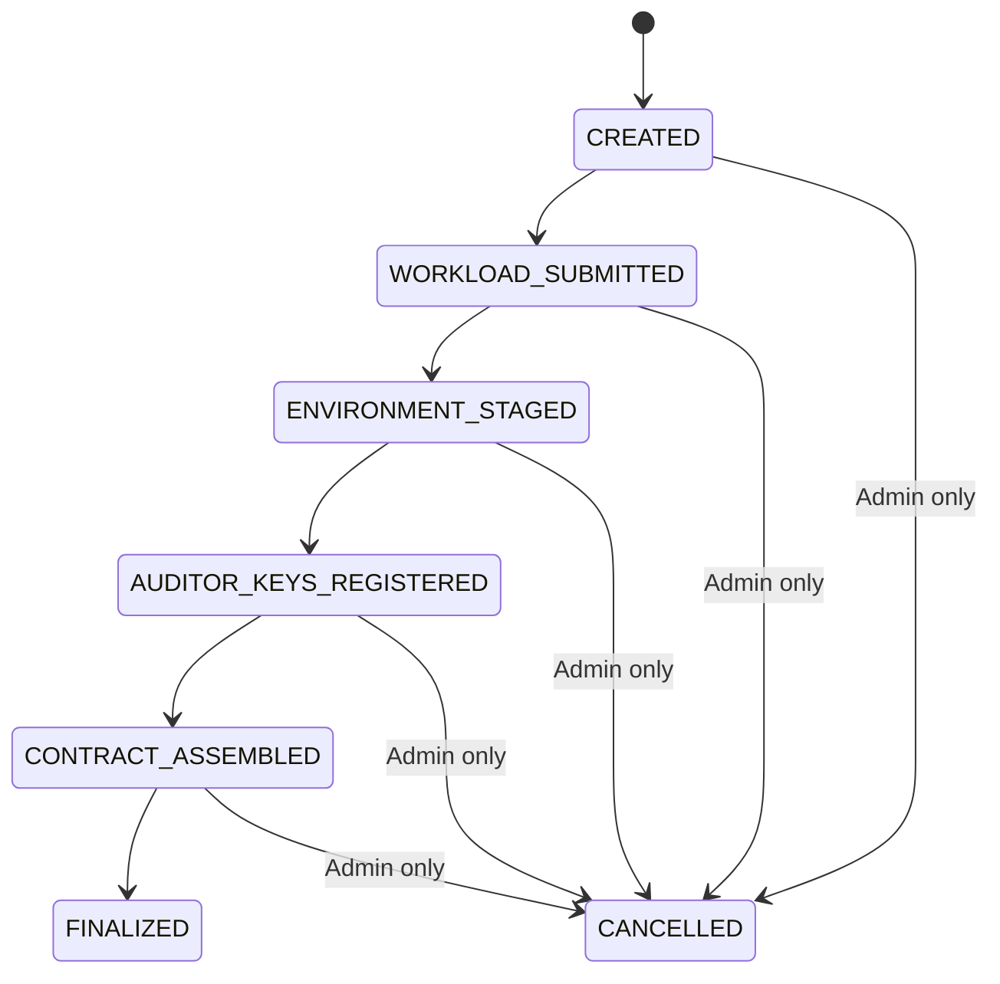
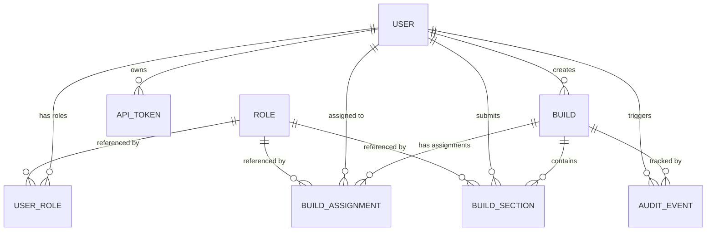
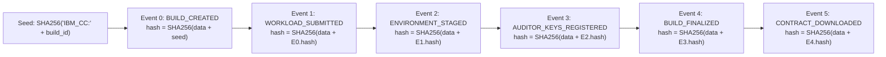

#IBM Confidential Computing Contract Generator — High-Level Design (HLD)

> **Version:** 0.4  
> **Date:** 2026-04-05  
> **Status:** Draft

---

## 1. Introduction

TheIBM Confidential Computing Contract Generator is a self-hosted, open-source system that enables organizations to collaboratively construct, sign, and finalize encrypted userdata contracts (YAML format) for **HPCR**, **HPCR4RHVS**, and **HPCC** deployments.

The system enforces a strict, linear, multi-persona workflow with cryptographic identity binding. Each persona registers an RSA public key at account creation and contributes exactly once per build. Builds require explicit user-to-role assignments, ensuring accountability. Once finalized, the contract becomes immutable.

### Architectural Principles

- All cryptographic operations are executed locally on the **Electron desktop application** (React + IBM Carbon UI).
- The backend **never** performs encryption, signing, or contract assembly.
- The backend only orchestrates workflow, verifies signatures against **registered public keys**, stores encrypted artifacts, and maintains an audit hash chain.
- Every user registers a public key; the corresponding private key **never** leaves the user's machine.
- Build participation requires explicit assignment — having the correct role alone is insufficient.
- The final artifact is a signed and encrypted YAML contract file.

---

## 2. Goals & Non-Goals

### Goals

- Enforce separation of duties across personas
- Bind cryptographic identity to user accounts via public key registration
- Ensure strict linear state progression
- Maintain cryptographic audit trail with identity-bound signatures
- Keep private keys client-side only
- Protect sensitive data at every stage with cryptographic guarantees (not just RBAC)
- Produce immutable final YAML contract
- Support LAN and internet deployments
- Fully open-source stack

### Non-Goals

- Multi-tenant SaaS
- Centralized key management
- Real-time collaboration
- HPCR orchestration

---

## 3. System Context

### Customer Environment

```
[ Electron Desktop App ]  <--HTTPS-->  [ nginx Reverse Proxy ]
                                              |
                                              v
                                        [ Go Backend ]
                                              |
                                              v
                                        [ PostgreSQL ]
```

### Deployment Target

```
[ HPCR Instance ]  <-- receives YAML userdata file
```

### Key Points

- nginx is **mandatory** for TLS termination.
- Backend is never directly internet-exposed.
- All crypto operations occur locally.
- Backend stores only encrypted or hashed data.
- Backend verifies signatures against registered public keys — never against request-supplied keys.
- Contract CLI (using Contract Go) is invoked via Node.js child_process in the Electron main process.

### Desktop Application Architecture

The Electron desktop application is the primary client interface for all users. It enforces client-side cryptography and provides a secure, user-friendly interface built with React and IBM Carbon Design System.

**Key Features:**

1. **Security-First Design**
   - All cryptographic operations execute in the Electron main process (Node.js)
   - Renderer process (React UI) has no direct access to crypto APIs
   - Context isolation and sandbox mode enabled
   - Secure IPC communication via preload script
   - Private keys never leave the user's machine

2. **User Interface**
   - IBM Carbon Design System for consistent, professional UI
   - Dark mode (g100) as default theme
   - Custom frameless window with branded title bar
   - Role-based navigation and access control
   - Boot screen with progressive loading
   - Split-screen login with feature showcase

3. **State Management**
   - Zustand for lightweight, performant state management
   - Persistent storage for auth tokens and configuration
   - Session-only storage for sensitive build data
   - Automatic cleanup on logout and app close

4. **Key Views**
   - **Home Dashboard**: Account overview, system alerts, build actions
   - **Build Management**: Create, view, and manage contract builds
   - **Build Details**: Section-by-section signing and status tracking
   - **User Management**: CRUD operations, role assignment (Admin only)
   - **Admin Analytics**: System diagnostics, security monitoring (Admin only)
   - **System Logs**: Comprehensive audit trail with search and export (Admin/Auditor)
   - **Account Settings**: Profile, password, and key management
   - **Login**: Split-screen with server configuration and remember email

5. **Cryptographic Operations**
   - RSA-4096 key pair generation (identity and attestation)
   - AES-256-GCM symmetric encryption
   - RSA-OAEP key wrapping/unwrapping
   - SHA-256 hashing
   - RSA-PSS signing and verification
   - Secure key storage per user ID
   - Integration with contract-cli via child_process

6. **Production Distribution**
   - Cross-platform builds (macOS, Windows, Linux)
   - Code signing support for trusted distribution
   - Auto-update capability (configurable)
   - Installer and portable versions
   - Comprehensive build documentation


---

## 4. Personas & Responsibilities

### Account Setup (First Login)

When a user is created (by Admin or seeded at deployment), they receive an initial password. On first login, the Electron desktop app enforces a **mandatory setup flow** before the user can access any functionality:

1. **Change password** — user must replace the admin-assigned initial password.
2. **Generate RSA-4096 key pair** locally on the desktop application.
3. **Register public key** with the backend.

Until setup is complete, the backend restricts the token to setup-only endpoints (password change, public key registration, logout). All other endpoints return `403 Account setup incomplete`.

> The seeded Admin user (created from `ADMIN_EMAIL`/`ADMIN_PASSWORD` env vars at deployment) follows the same setup flow on first login.

---

### Public Key Registration & Expiry

Every user registers an RSA-4096 **public key** with their profile. The private key never leaves the user's machine.

Public keys have a configurable expiry (default: **90 days**). When a key expires:
- The user is blocked from participating in builds until they register a new key.
- The auth middleware treats an expired key similarly to a missing key — setup-only endpoints are accessible.
- Previous signatures made with the old key remain valid for audit verification (the fingerprint in audit events references the key used at the time).

This enables:

- **Identity-bound signature verification** — the backend verifies all signatures against the user's registered public key, not a request-supplied key.
- **Secure key wrapping** — personas can encrypt data so only a specific other persona can decrypt it (e.g., Data Owner wraps the symmetric key for the Auditor).
- **Key rotation** — expired keys force users to generate fresh key pairs, limiting the impact of a compromised private key.

---

### Credential Rotation Policy

The backend enforces periodic credential rotation:

| Credential | Rotation Interval | Mechanism |
|---|---|---|
| **Password** | Every 90 days (configurable) | Backend sets `must_change_password = true` via a scheduled job. User is forced into setup flow on next login. |
| **Public Key** | Every 90 days (configurable) | Backend checks `public_key_expires_at`. Expired keys block build participation until a new key is registered. |

Both intervals are configurable via environment variables (`PASSWORD_ROTATION_DAYS`, `PUBLIC_KEY_EXPIRY_DAYS`).

---

### Build Assignments

When a build is created, the Admin **assigns specific users** to each persona role for that build. Only the assigned user can act in that role. This provides two layers of access control:

1. **Role-based:** User must have the correct persona role.
2. **Assignment-based:** User must be explicitly assigned to this specific build.

---

### Solution Provider

| | |
|---|---|
| **Provides** | Workload section payload |
| **Local Actions** | Encrypt workload using `contract-cli` (via `contract-go`), Compute SHA256 hash of encrypted workload, Sign hash with private key |
| **Uploads** | `role_id`, `encrypted_payload`, `section_hash`, `signature` (via `POST /builds/{id}/sections`) |

**Notes:**

- Section `signature`/`section_hash` are persisted with the section row.
- Mutating request signature headers (`X-Signature*`) are verified against the actor's registered public key.

---

### Data Owner

| | |
|---|---|
| **Provides** | Environment configuration (logging credentials, secrets, env vars) |

**Local Actions:**

1. Retrieve the assigned Auditor's registered public key from the backend.
2. Generate the environment section (plaintext locally).
3. Generate a random AES-256 symmetric key.
4. Encrypt environment section using the symmetric key (AES-256-GCM).
5. Wrap (encrypt) the symmetric key with the Auditor's RSA public key (RSA-OAEP).
6. Compute SHA256 hash of the encrypted env payload.
7. Sign hash with private key.

**Uploads:** `role_id`, `encrypted_payload`, `encrypted_symmetric_key`, `section_hash`, `signature` (via `POST /builds/{id}/sections`)

**Result:** Environment section is securely staged. **Only the assigned Auditor** can unwrap the symmetric key and read the environment — the backend cannot.

---

### Auditor (Sign & Add Attestation)

| | |
|---|---|
| **Provides** | Attestation public key, Signing key/cert, Final assembled contract |

**Local Actions (Sign & Add Attestation tab + Finalise Contract tab):**

1. Generate signing key/cert locally.
2. Generate attestation key pair locally.
3. Download: `workload.enc`, `encrypted_env_payload`, `wrapped_symmetric_key` (returned as `wrapped_symmetric_key` in section data).
4. Unwrap symmetric key using own RSA private key (RSA-OAEP decrypt).
5. Decrypt environment section using symmetric key (AES-256-GCM decrypt).
6. Inject signing certificate/public key into environment section.
7. Generate encrypted environment preview and encrypt attestation public key using HPCR encryption certificate via `contract-cli`.
8. Confirm readiness with backend via `POST /builds/{id}/attestation` (idempotent state confirmation; no key material uploaded).
9. Assemble final YAML contract:
   - Encrypted workload
   - Encrypted environment (with signing key/cert embedded)
   - Encrypted Attestation public key
10. Compute: `contract_hash = SHA256(contract.yaml)`
11. Sign `contract_hash` with the Auditor's **registered identity private key** (RSA-PSS with SHA-256). This is the same key pair registered during account setup, ensuring the backend can verify the signature against the Auditor's registered public key.
12. Upload: `contract_yaml`, `contract_hash`, `signature`, `public_key`

**Backend Actions:**

- Verifies the Auditor is the assigned user for this build.
- Verifies signature against the Auditor's **registered public key**.
- Stores `contract_yaml` (raw YAML in current flow; backward compatible with older base64-stored rows during verification/export).
- Marks build as **FINALIZED** with `is_immutable = true`.
- Emits audit event.

---

### Env Operator

| | |
|---|---|
| **Provides** | Download acknowledgment (signed receipt) |

**Local Actions:**

1. Download finalized YAML contract from backend (`/export` or `/userdata`).
2. Electron desktop app handles both raw YAML and legacy base64 values (for backward compatibility) and writes raw YAML locally.
3. Compute `SHA256(contract.yaml)` locally and verify it matches the build's `contract_hash`.
4. Sign the `contract_hash` with the Env Operator's **registered identity private key**.
5. Upload signed acknowledgment to backend.
6. Deploy the decoded YAML to the HPCR instance.

**Backend Actions:**

- Verifies the Env Operator is the assigned user for this build.
- Verifies signature against the Env Operator's **registered public key**.
- Emits `CONTRACT_DOWNLOADED` audit event with signature.

> This creates a cryptographic proof-of-receipt: the audit chain records that the assigned Env Operator downloaded and verified the correct contract.

---

### Admin

| | |
|---|---|
| **Provides** | Signed build creation metadata, user management |

**Build Creation (Local Actions):**

1. Compose build metadata: name + assignments (user-to-role mapping).
2. Compute `SHA256(canonical_json(build_metadata))` locally.
3. Sign the hash with the Admin's **registered identity private key**.
4. Upload build request with signature.

**Backend Actions:**

- Verifies signature against the Admin's **registered public key**.
- Creates build + assignments in a transaction.
- Emits `BUILD_CREATED` audit event with Admin's signature.

**Other Admin responsibilities:**

- Creates users (triggers public key registration on client)
- Cancels pre-finalized builds
- Manages user roles

---

### Viewer

- Read-only access to builds and audit logs.

---

## 5. Build Lifecycle



### Invariants

- Strict linear progression.
- Each persona contributes exactly once.
- Build participation requires both correct role **and** explicit assignment.
- No concurrent edits.
- **FINALIZED** builds are immutable.
- Backend performs no contract assembly.
- Signatures are verified against registered public keys, never request-supplied keys.
- The backend never has access to the symmetric key protecting the environment section.

---

## 6. Core Domain Model

### How the Tables Connect

The domain model consists of 8 entities. Here's how they relate:



**Reading the model:**

- **User** — A person using the system. Carries their identity (password, public key) and links to everything they do.
- **Role** — A reference table of persona types (seeded at deployment). Not an ENUM — it's a first-class table so all other tables reference it via foreign key.
- **User Role** — Junction table: "User X has role Y, assigned by Admin Z." A user can have multiple roles.
- **Build** — A contract being collaboratively constructed. Tracks the current status, stores the encryption certificate (from SP), and eventually holds the final contract YAML (raw YAML in current flow; legacy rows may be base64).
- **Build Assignment** — "For Build B, role Y is performed by User X." This is how the Admin binds specific users to specific builds. One user per role per build.
- **Build Section** — Encrypted data submitted by a persona during the build. Only 2 sections per build: workload (from SP) and environment (from DO). Contains the encrypted payload, the hash, and the user's signature.
- **Audit Event** — A tamper-evident log entry. Each event hashes its data together with the previous event's hash, forming an unbreakable chain. Signed by the actor's registered key.
- **API Token** — Bearer tokens for authentication. Stored as SHA-256 hashes (never plaintext). Have an expiry date and can be revoked.

### User

| Field | Type |
|---|---|
| `id` | UUID |
| `name` | string |
| `email` | string |
| `password_hash` | string |
| `must_change_password` | bool (default: true) |
| `password_changed_at` | timestamp |
| `public_key` | text (nullable) |
| `public_key_fingerprint` | string (nullable) |
| `public_key_registered_at` | timestamp (nullable) |
| `public_key_expires_at` | timestamp (nullable) |
| `is_active` | bool |
| `created_at` | timestamp |
| `updated_at` | timestamp |

### Role

| Field | Type |
|---|---|
| `id` | UUID |
| `name` | string (unique) |
| `description` | text |
| `created_at` | timestamp |
| `updated_at` | timestamp |

> Roles are a reference table seeded at deployment: `SOLUTION_PROVIDER`, `DATA_OWNER`, `AUDITOR`, `ENV_OPERATOR`, `ADMIN`, `VIEWER`. All other tables reference roles via foreign key.

### User Role

| Field | Type |
|---|---|
| `user_id` | reference → User |
| `role_id` | reference → Role |
| `assigned_by` | reference → User |
| `assigned_at` | timestamp |
| `updated_at` | timestamp |

### Build

| Field | Type |
|---|---|
| `id` | UUID |
| `name` | string |
| `status` | ENUM |
| `created_by` | reference → User |
| `encryption_certificate` | text |
| `created_at` | timestamp |
| `finalized_at` | timestamp |
| `contract_hash` | string |
| `contract_yaml` | text (raw YAML in current flow; backward compatible with legacy base64 rows) |
| `is_immutable` | bool |

### Build Assignment

| Field | Type |
|---|---|
| `id` | UUID |
| `build_id` | reference → Build |
| `role_id` | reference → Role |
| `user_id` | reference → User |
| `assigned_by` | reference → User |
| `assigned_at` | timestamp |

### Build Section

| Field | Type |
|---|---|
| `id` | UUID |
| `build_id` | reference → Build |
| `role_id` | reference → Role |
| `submitted_by` | reference → User |
| `encrypted_payload` | text |
| `wrapped_symmetric_key` | text (nullable, request field alias in UI/API: `encrypted_symmetric_key`) |
| `section_hash` | string |
| `signature` | string |
| `submitted_at` | timestamp |

### Audit Event

| Field | Type |
|---|---|
| `id` | UUID |
| `build_id` | reference (nullable) |
| `sequence_no` | integer |
| `event_type` | ENUM |
| `actor_user_id` | reference |
| `actor_key_fingerprint` | string |
| `ip_address` | string |
| `device_metadata` | JSON |
| `event_data` | JSON |
| `previous_event_hash` | string |
| `event_hash` | string |
| `signature` | string |
| `created_at` | timestamp |

### API Token

| Field | Type |
|---|---|
| `id` | UUID |
| `user_id` | reference |
| `name` | string |
| `token_hash` | string |
| `expires_at` | timestamp |
| `last_used_at` | timestamp |
| `revoked_at` | timestamp (nullable) |
| `created_at` | timestamp |

---

## 7. Cryptographic Standards

| Operation | Standard |
|---|---|
| **Asymmetric Keys** | RSA 4096-bit |
| **Signing** | RSA-PSS with SHA-256 (PKCS#1 v2.1) |
| **Symmetric Encryption** | AES-256-GCM |
| **Key Wrapping** | RSA-OAEP with SHA-256 |
| **Hashing** | SHA-256 |
| **Encoding** | Base64 (standard, with padding) for all binary payloads |
| **Certificates** | X.509v3 PEM |
| **Canonical JSON** | RFC 8785 (JSON Canonicalization Scheme) |

---

## 8. Audit Hash Chain

### What is the Audit Hash Chain?

Every significant action in the system (build creation, section submission, finalization, download) produces an **audit event**. These events are linked together in a **hash chain** — each event's hash incorporates the previous event's hash, forming a tamper-evident log. If any event is modified, deleted, or reordered, the chain breaks and verification fails.

### Who Signs What?

The current implementation carries signatures in two places:

1. **Audit event signatures (always required):**
| Event | Persona | Signed By |
|---|---|---|
| `BUILD_FINALIZED` | Auditor | Auditor's registered private key |
| `CONTRACT_DOWNLOADED` | Env Operator | Env Operator's registered private key |

2. **Request-signature derived audit signatures (captured when present):**
| Event | Persona | Source |
|---|---|---|
| `BUILD_CREATED` | Admin | `X-Signature` on signed mutating request |
| `ROLE_ASSIGNED` | Admin | `X-Signature` on signed mutating request |

Section submissions (`WORKLOAD_SUBMITTED`, `ENVIRONMENT_STAGED`) still carry cryptographic signatures on section payloads (`section_hash` + `signature`) in `build_sections`; these are separate from audit-event signature fields.

### How the Chain Works



### Step-by-Step Example

**Step 1 — Genesis (Seed Hash):**  
When a build is created, the chain starts with a deterministic seed:
```
seed = SHA256("IBM_CC:" + build_id)
     = SHA256("IBM_CC:550e8400-e29b-41d4-a716-446655440000")
     = "a1b2c3d4..."
```

**Step 2 — First Event (BUILD_CREATED):**  
The Admin creates the build. The event data is serialized to canonical JSON (RFC 8785), then hashed together with the seed:
```
event_data = {
    "actor_id": "admin-uuid",
    "actor_key_fingerprint": "abc123...",
    "build_id": "550e8400...",
    "details": { "name": "prod-v2.1", "assignments": { ... } },
    "event_type": "BUILD_CREATED",
    "timestamp": "2026-04-05T10:00:00Z"
}

previous_event_hash = "a1b2c3d4..."  (the seed)
event_hash = SHA256(canonical_json(event_data) + previous_event_hash)
           = "e5f6g7h8..."
signature  = RSA-PSS-Sign(event_hash, admin_private_key)
```

**Step 3 — Subsequent Events:**  
Each subsequent event uses the previous event's hash as its `previous_event_hash`, creating the chain:
```
Event 1 (WORKLOAD_SUBMITTED):
    previous_event_hash = "e5f6g7h8..."  (Event 0's hash)
    event_hash = SHA256(canonical_json(event_data) + "e5f6g7h8...")
    signature  = RSA-PSS-Sign(event_hash, sp_private_key)
```

### Why This Matters

- **Tamper detection:** If anyone modifies an event's data, its hash changes, which breaks the chain from that point forward.
- **Non-repudiation:** Each event is signed by the actor's registered private key. The actor cannot deny performing the action.
- **Accountability:** Every persona's contribution is cryptographically bound to their identity.
- **No loose ends:** Admin signs mutating requests (captured on `BUILD_CREATED`/`ROLE_ASSIGNED`), SP/DO sign section payloads, Auditor signs finalization, and Env Operator signs download acknowledgment.

### Verification

The `GET /builds/{id}/verify` endpoint:

1. Recomputes the seed from the build ID.
2. Walks each event in order, recomputing hashes.
3. Verifies each event's hash matches the stored hash.
4. Verifies each signature against the actor's **registered public key** (looked up via `actor_key_fingerprint`).
5. Validates that the contract hash in the `BUILD_FINALIZED` event matches the stored contract.
6. Returns a pass/fail report with details of any broken links.

---

## 9. API Surface

### Roles

| Method | Endpoint |
|---|---|
| `GET` | `/roles` |

### Auth

| Method | Endpoint |
|---|---|
| `POST` | `/auth/login` |
| `POST` | `/auth/logout` |

### Users

| Method | Endpoint |
|---|---|
| `GET` | `/users` |
| `POST` | `/users` |
| `PATCH` | `/users/{id}/roles` |
| `PUT` | `/users/{id}/public-key` |
| `GET` | `/users/{id}/public-key` |
| `PATCH` | `/users/{id}/password` |
| `GET` | `/users/{id}/tokens` |
| `POST` | `/users/{id}/tokens` |
| `DELETE` | `/users/{id}/tokens/{token_id}` |

### Builds

| Method | Endpoint |
|---|---|
| `GET` | `/builds` |
| `POST` | `/builds` |
| `GET` | `/builds/{id}` |
| `POST` | `/builds/{id}/cancel` |
| `GET` | `/builds/{id}/assignments` |
| `POST` | `/builds/{id}/assignments` |

### Sections

| Method | Endpoint |
|---|---|
| `POST` | `/builds/{id}/sections` |
| `POST` | `/builds/{id}/attestation` |
| `POST` | `/builds/{id}/finalize` |
| `GET` | `/builds/{id}/sections` |

### Audit & Export

| Method | Endpoint |
|---|---|
| `GET` | `/builds/{id}/audit` |
| `GET` | `/builds/{id}/verify` |
| `GET` | `/builds/{id}/export` |
| `GET` | `/builds/{id}/userdata` |
| `POST` | `/builds/{id}/acknowledge-download` |

---

## 10. System Architecture

### Reverse Proxy (Mandatory: nginx)

**Responsibilities:**

- TLS 1.3 termination
- Rate limiting
- Request body size limits
- Security headers
- Optional IP allowlisting

### Backend (Go)

**Components:**

- HTTP Layer
- `BuildService` (state machine enforcement + assignment checks)
- `AuditService`
- `VerificationService`
- `ExportService`
- `UserService`
- Repository Layer (`sqlc` + `pgx`)

### Database

- PostgreSQL 16

---

## 11. Security Design

| Category | Details |
|---|---|
| **Transport Security** | TLS 1.3 via nginx |
| **Authentication** | Bearer tokens (stored hashed, with expiry) |
| **Authorization** | Strict server-side RBAC + per-build assignment checks |
| **Mutating Request Signing** | All authenticated mutating endpoints require `X-Signature`, `X-Signature-Hash`, `X-Timestamp` (+ optional `X-Key-Fingerprint`) except setup/logout exemptions; backend verifies against registered user public key |
| **Cryptographic Identity** | All users register RSA-4096 public keys; signatures verified against registered keys; keys expire after 90 days (configurable) |
| **Private Key Isolation** | All private keys generated and stored locally; never transmitted |
| **Credential Rotation** | Passwords and public keys rotate every 90 days (configurable). Backend forces setup flow on expiry |
| **First-Login Enforcement** | All new users (including seeded admin) must change password and register public key before accessing any functionality |
| **Environment Staging Protection** | Encrypted with AES-256-GCM locally; symmetric key wrapped with Auditor's RSA public key (RSA-OAEP). Backend never has access to the unwrapped symmetric key |
| **Final Contract Integrity** | SHA256 hash + signature; immutable after FINALIZED |
| **Audit Integrity** | Deterministic hash chain (RFC 8785 canonical JSON); signature verification per event using registered keys |
| **Data at Rest** | Only encrypted payloads stored; disk-level encryption recommended |

---

## 12. Deployment Topology

```
[ Electron Desktop App ]
(React + IBM Carbon UI)
       |
       v
[ nginx Reverse Proxy ]
       |
       v
[ Go Backend ]
       |
       v
[ PostgreSQL ]
```

- Single binary backend.
- Docker Compose or bare metal deployment supported.

---

## 13. Summary of v0.4 Changes

- **Public key registration:** All personas register RSA-4096 public keys at account creation. Private keys never leave the client.
- **Build assignments:** Admin assigns specific users to persona roles per build. RBAC is now two-layered (role + assignment).
- **Identity-bound signature verification:** Backend verifies all signatures against registered public keys, not request-supplied keys.
- **Secure environment staging via key wrapping:** Data Owner wraps the AES symmetric key with the Auditor's registered RSA public key (RSA-OAEP). Backend never sees the unwrapped key. Only the assigned Auditor can decrypt.
- **`CONTRACT_ASSEMBLED` retained in current backend state machine:** `AUDITOR_KEYS_REGISTERED` → `CONTRACT_ASSEMBLED` → `FINALIZED`.
- **Added cryptographic standards section (§7):** RSA-4096, RSA-PSS/SHA-256, AES-256-GCM, RSA-OAEP, RFC 8785.
- **Token expiry:** API tokens now have an `expires_at` field.
- **New API endpoints:** Public key management, build assignments, section downloads, password change.
- **Audit event `build_id` is now nullable** to support system-level events (user creation, role assignment, token management).
- **Encryption certificate stored on build:** Solution Provider uploads the HPCR encryption certificate; stored on the build for the Auditor to retrieve.
- **First-login setup flow:** All new users (including seeded admin) must change password and register public key on first login.
- **Credential rotation:** Passwords and public keys expire every 90 days (configurable). Expired credentials force the user into setup flow.
- **Public key expiry:** Keys have a configurable `public_key_expires_at` timestamp. Expired keys block build participation.
- **Admin signs build creation:** Build creation requests include the Admin's signature, providing cryptographic proof of who authorized the build and its assignments.
- **Request-signature metadata captured in audit chain:** `BUILD_CREATED` and `ROLE_ASSIGNED` persist `request_signature_hash` and associated request signature.
- **Env Operator download acknowledgment:** Env Operator signs the contract hash upon download, providing cryptographic proof of receipt in the audit chain.
- **Attestation confirmation is idempotent:** Re-running `POST /builds/{id}/attestation` returns success when already registered/finalized.
- **Contract storage compatibility:** Verification/export logic supports both raw YAML and legacy base64 contract rows.
- **Expanded audit hash chain documentation (§8):** Detailed walkthrough with diagrams and examples for clarity.

---

> *End ofIBM Confidential Computing Contract Generator HLD v0.4*
