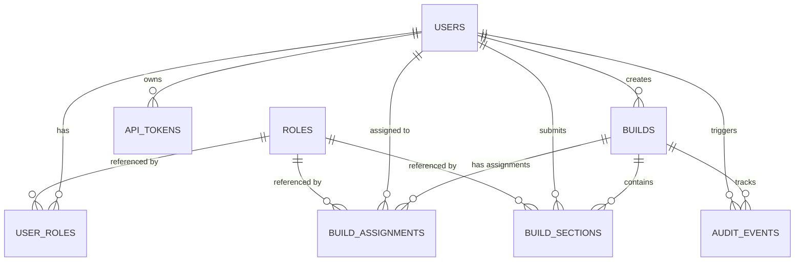
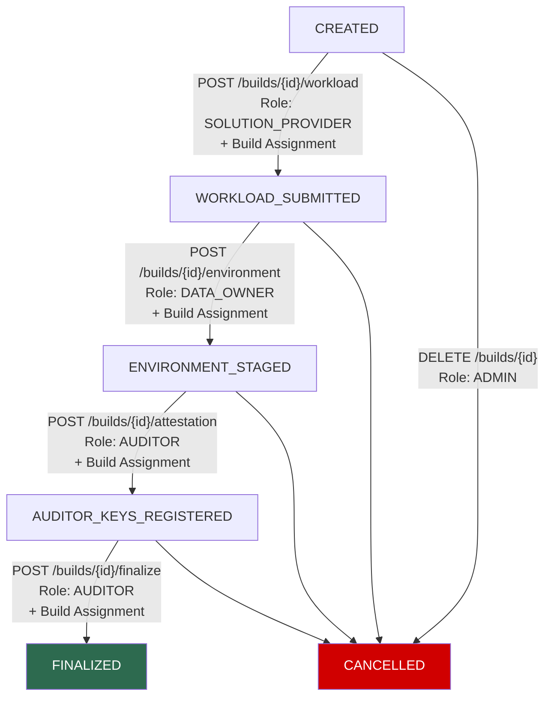
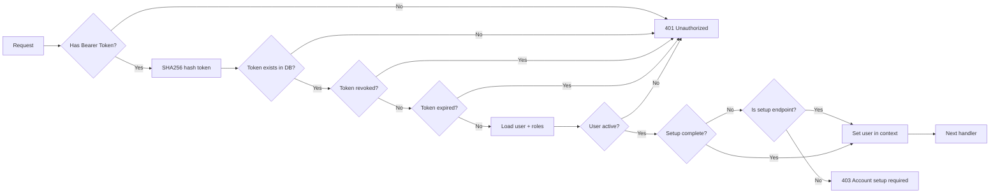
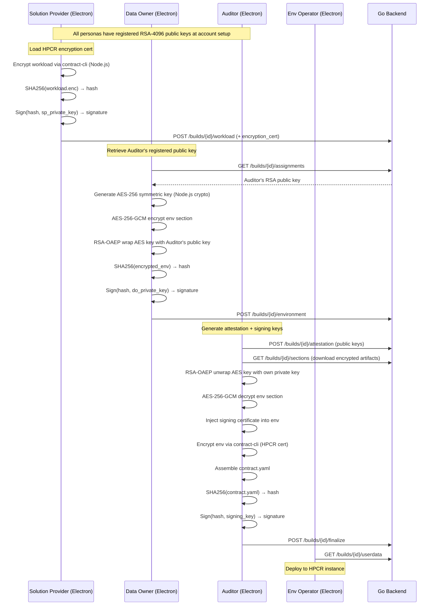

#IBM Confidential Computing Contract Generator — Low-Level Design (LLD)

> **Version:** 0.2  
> **Date:** 2026-04-05  
> **Status:** Draft  
> **Parent Document:** [high-level-design.md](./high-level-design.md)

---

## 1. Project Structure

### 1.1 Go Backend

```
backend/
├── cmd/
│   └── server/
│       └── main.go                  # Entry point, config loading, server bootstrap
├── internal/
│   ├── config/
│   │   └── config.go                # Env-based configuration struct
│   ├── middleware/
│   │   ├── auth.go                  # Bearer token authentication
│   │   ├── rbac.go                  # Role-based access control
│   │   ├── assignment.go            # Per-build assignment enforcement
│   │   ├── logging.go               # Request/response logging
│   │   └── ratelimit.go             # Per-IP / per-user rate limiting
│   ├── handler/
│   │   ├── auth_handler.go          # POST /auth/login, /auth/logout
│   │   ├── user_handler.go          # User CRUD + token + public key management
│   │   ├── build_handler.go         # Build CRUD + assignments
│   │   ├── section_handler.go       # Workload, env, attestation, finalize
│   │   └── audit_handler.go         # Audit log, verify, export, userdata
│   ├── service/
│   │   ├── auth_service.go          # Login/logout logic, token hashing
│   │   ├── user_service.go          # User + role + API token + public key mgmt
│   │   ├── build_service.go         # Build lifecycle, state machine, assignments
│   │   ├── section_service.go       # Section submission & validation
│   │   ├── audit_service.go         # Audit event creation & hash chain
│   │   ├── verification_service.go  # Hash chain + signature verification
│   │   └── export_service.go        # Contract export + userdata download
│   ├── repository/
│   │   ├── queries/                 # sqlc SQL query files
│   │   │   ├── users.sql
│   │   │   ├── builds.sql
│   │   │   ├── build_assignments.sql
│   │   │   ├── sections.sql
│   │   │   ├── audit_events.sql
│   │   │   └── api_tokens.sql
│   │   ├── db.go                    # sqlc generated DB interface
│   │   ├── models.go                # sqlc generated model structs
│   │   └── queries.sql.go           # sqlc generated query methods
│   ├── model/
│   │   ├── build.go                 # Build domain types + status enum
│   │   ├── user.go                  # User + role domain types
│   │   ├── audit.go                 # Audit event domain types
│   │   └── errors.go                # Domain-specific error types
│   └── crypto/
│       ├── hash.go                  # SHA256 helpers
│       └── signature.go             # Signature verification (registered public keys only)
├── migrations/
│   ├── 001_create_enums.up.sql
│   ├── 001_create_enums.down.sql
│   ├── 002_create_roles.up.sql
│   ├── 002_create_roles.down.sql
│   ├── 003_create_users.up.sql
│   ├── 003_create_users.down.sql
│   ├── 004_create_user_roles.up.sql
│   ├── 004_create_user_roles.down.sql
│   ├── 005_create_api_tokens.up.sql
│   ├── 005_create_api_tokens.down.sql
│   ├── 006_create_builds.up.sql
│   ├── 006_create_builds.down.sql
│   ├── 007_create_build_assignments.up.sql
│   ├── 007_create_build_assignments.down.sql
│   ├── 008_create_build_sections.up.sql
│   ├── 008_create_build_sections.down.sql
│   ├── 009_create_audit_events.up.sql
│   └── 009_create_audit_events.down.sql
├── go.mod
├── go.sum
├── sqlc.yaml
└── Dockerfile
```

### 1.2 Electron Desktop App (React + IBM Carbon UI)

```
app/
├── main/                             # Main Process (Node.js)
│   ├── index.js                      # Electron main process entry, window management, IPC handlers
│   ├── preload.js                    # Preload script for secure IPC bridge (contextBridge)
│   └── crypto/                       # Cryptographic operations (main process only)
│       ├── contractCli.js            # Node.js bridge to contract-cli (child_process)
│       ├── keyManager.js             # RSA-4096 key generation, fingerprints
│       ├── encryptor.js              # AES-256-GCM encryption, RSA-OAEP key wrapping
│       ├── signer.js                 # SHA-256 hashing, RSA-PSS signing/verification
│       └── keyStorage.js             # Secure key storage per user ID
│
├── src/                              # Renderer Process (React)
│   ├── main.jsx                      # React app entry point
│   ├── App.jsx                       # Root component with routing, boot screen
│   ├── index.scss                    # Global styles (Carbon theme)
│   │
│   ├── assets/                       # Static assets
│   │   └── CloudHyperProtect.svg     # IBM Cloud Hyper Protect logo
│   │
│   ├── components/                   # Reusable UI components
│   │   ├── AppShell.jsx              # Main layout: Header, SideNav, Footer, Window Controls
│   │   └── HyperProtectIcon.jsx      # Custom IBM Hyper Protect icon component
│   │
│   ├── views/                        # Page components (route-based)
│   │   ├── Login.jsx                 # Split-screen login with server config, remember email
│   │   ├── Home.jsx                  # Dashboard: account overview, build overview, alerts
│   │   ├── BuildManagement.jsx       # Build list, filtering, search
│   │   ├── BuildDetails.jsx          # Build details, section signing, status tracking
│   │   ├── UserManagement.jsx        # User CRUD, role assignment, key/password status
│   │   ├── AdminAnalytics.jsx        # System diagnostics, expired keys/passwords, statistics
│   │   ├── SystemLogs.jsx            # Audit trail, search, filter, CSV export
│   │   ├── AccountSettings.jsx       # Profile, password change, key management
│   │   └── NotFound.jsx              # 404 error page
│   │
│   ├── services/                     # API & business logic
│   │   ├── apiClient.js              # Axios HTTP client with interceptors
│   │   ├── authService.js            # Login, logout, token management
│   │   ├── buildService.js           # Build CRUD + assignment API calls
│   │   └── cryptoService.js          # IPC bridge to main process crypto operations
│   │
│   ├── store/                        # State management (Zustand)
│   │   ├── authStore.js              # Authentication state with persistence
│   │   ├── buildStore.js             # Build list + detail state
│   │   ├── configStore.js            # Server URL configuration with persistence
│   │   ├── themeStore.js             # Theme preferences (dark/light mode)
│   │   ├── uiStore.js                # UI state (modals, notifications, loading)
│   │   └── mockData.js               # Mock data for development (10 test users)
│   │
│   ├── styles/                       # Custom styling
│   │   └── modern-theme.scss         # Carbon Design System theme overrides
│   │
│   └── utils/                        # Utility functions
│       ├── constants.js              # Application constants
│       ├── formatters.js             # Data formatting utilities
│       ├── validators.js             # Input validation utilities
│       └── cryptoMock.js             # Mock crypto for development
│
├── package.json                      # Dependencies, scripts, metadata
├── vite.config.js                    # Vite bundler configuration
├── electron-builder.json             # Electron Builder configuration for packaging
├── index.html                        # HTML template
├── BUILD.md                          # Production build instructions
└── DUMMY_CREDENTIALS.md              # Test credentials for development
```

#### Key Implementation Details

**Main Process (Electron)**:
- Frameless window with custom title bar
- Window controls (minimize, maximize, close)
- IPC handlers for crypto, file operations, shell operations
- Session management and cleanup on close/quit
- Sandbox mode enabled for security

**Renderer Process (React)**:
- Carbon Design System (IBM) for UI components
- Zustand for state management with persistence
- Axios for HTTP client with interceptors
- Role-based navigation and access control
- Boot screen with progressive loading
- Split-screen login with feature showcase
- External links open in system default browser

**Security Features**:
- Context isolation enabled
- Node integration disabled
- Sandbox mode enabled
- Content Security Policy configured
- All crypto operations in main process
- Secure IPC communication via preload script

---

## 2. Database Schema (PostgreSQL 16)

### 2.1 Enums

```sql
CREATE TYPE build_status AS ENUM (
    'CREATED',
    'WORKLOAD_SUBMITTED',
    'ENVIRONMENT_STAGED',
    'AUDITOR_KEYS_REGISTERED',
    'FINALIZED',
    'CANCELLED'
);

CREATE TYPE audit_event_type AS ENUM (
    'BUILD_CREATED',
    'WORKLOAD_SUBMITTED',
    'ENVIRONMENT_STAGED',
    'AUDITOR_KEYS_REGISTERED',
    'BUILD_FINALIZED',
    'BUILD_CANCELLED',
    'USER_CREATED',
    'ROLE_ASSIGNED',
    'TOKEN_CREATED',
    'TOKEN_REVOKED',
    'PUBLIC_KEY_REGISTERED',
    'CONTRACT_DOWNLOADED',
    'DOWNLOAD_ACKNOWLEDGED'
);
```

### 2.2 Roles Table (Reference Data)

```sql
CREATE TABLE roles (
    id          UUID PRIMARY KEY DEFAULT gen_random_uuid(),
    name        VARCHAR(50)     NOT NULL UNIQUE,
    description TEXT,
    created_at  TIMESTAMPTZ     NOT NULL DEFAULT now()
);

-- Seed data (run once at deployment)
INSERT INTO roles (name, description) VALUES
    ('SOLUTION_PROVIDER', 'Provides workload definition and HPCR encryption certificate'),
    ('DATA_OWNER',        'Provides environment configuration, logging credentials, and secrets'),
    ('AUDITOR',           'Performs final contract assembly, encryption, and signing'),
    ('ENV_OPERATOR',      'Downloads and deploys finalized contracts to HPCR instances'),
    ('ADMIN',             'System administration: user management, role assignment, build cancellation'),
    ('VIEWER',            'Read-only access to builds and audit logs');
```

> **Note:** Roles are a reference table — not an ENUM. All other tables (user_roles, build_assignments, build_sections) reference `roles(id)` via foreign key. This allows adding new roles without a schema migration.

### 2.3 Users Table

```sql
CREATE TABLE users (
    id                       UUID PRIMARY KEY DEFAULT gen_random_uuid(),
    name                     VARCHAR(255)    NOT NULL,
    email                    VARCHAR(255)    NOT NULL UNIQUE,
    password_hash            TEXT            NOT NULL,
    must_change_password     BOOLEAN         NOT NULL DEFAULT true,
    password_changed_at      TIMESTAMPTZ,
    public_key               TEXT,
    public_key_fingerprint   VARCHAR(64),
    public_key_registered_at TIMESTAMPTZ,
    public_key_expires_at    TIMESTAMPTZ,
    is_active                BOOLEAN         NOT NULL DEFAULT true,
    created_at               TIMESTAMPTZ     NOT NULL DEFAULT now(),
    updated_at               TIMESTAMPTZ     NOT NULL DEFAULT now()
);

CREATE INDEX idx_users_email ON users (email);
CREATE INDEX idx_users_fingerprint ON users (public_key_fingerprint);
CREATE INDEX idx_users_key_expiry ON users (public_key_expires_at);

-- Auto-update updated_at on row modification
CREATE OR REPLACE FUNCTION update_updated_at()
RETURNS TRIGGER AS $$
BEGIN NEW.updated_at = now(); RETURN NEW; END;
$$ LANGUAGE plpgsql;

CREATE TRIGGER trg_users_updated_at
    BEFORE UPDATE ON users
    FOR EACH ROW EXECUTE FUNCTION update_updated_at();
```

### 2.4 User Roles Table

```sql
CREATE TABLE user_roles (
    id          UUID PRIMARY KEY DEFAULT gen_random_uuid(),
    user_id     UUID            NOT NULL REFERENCES users(id) ON DELETE CASCADE,
    role_id     UUID            NOT NULL REFERENCES roles(id),
    assigned_by UUID            NOT NULL REFERENCES users(id),
    assigned_at TIMESTAMPTZ     NOT NULL DEFAULT now(),

    UNIQUE (user_id, role_id)
);

CREATE INDEX idx_user_roles_user_id ON user_roles (user_id);
CREATE INDEX idx_user_roles_role_id ON user_roles (role_id);
```

### 2.5 API Tokens Table

```sql
CREATE TABLE api_tokens (
    id           UUID PRIMARY KEY DEFAULT gen_random_uuid(),
    user_id      UUID            NOT NULL REFERENCES users(id) ON DELETE CASCADE,
    name         VARCHAR(255)    NOT NULL,
    token_hash   TEXT            NOT NULL UNIQUE,
    expires_at   TIMESTAMPTZ     NOT NULL,
    last_used_at TIMESTAMPTZ,
    revoked_at   TIMESTAMPTZ,
    created_at   TIMESTAMPTZ     NOT NULL DEFAULT now()
);

CREATE INDEX idx_api_tokens_user_id ON api_tokens (user_id);
CREATE INDEX idx_api_tokens_token_hash ON api_tokens (token_hash);
```

### 2.6 Builds Table

```sql
CREATE TABLE builds (
    id                      UUID PRIMARY KEY DEFAULT gen_random_uuid(),
    name                    VARCHAR(255)    NOT NULL,
    status                  build_status    NOT NULL DEFAULT 'CREATED',
    created_by              UUID            NOT NULL REFERENCES users(id),
    encryption_certificate  TEXT,
    created_at              TIMESTAMPTZ     NOT NULL DEFAULT now(),
    finalized_at            TIMESTAMPTZ,
    contract_hash           TEXT,
    contract_yaml           TEXT,           -- stored as base64-encoded string
    is_immutable            BOOLEAN         NOT NULL DEFAULT false
);

CREATE INDEX idx_builds_status ON builds (status);
CREATE INDEX idx_builds_created_by ON builds (created_by);
```

> **Note:** `contract_yaml` is stored as a base64-encoded string; the Flutter desktop app decodes it to produce the raw YAML file for deployment. Attestation keys and signing certificates are embedded (encrypted) within the final contract — the backend does not store them.

### 2.7 Build Assignments Table

```sql
CREATE TABLE build_assignments (
    id           UUID PRIMARY KEY DEFAULT gen_random_uuid(),
    build_id     UUID            NOT NULL REFERENCES builds(id) ON DELETE CASCADE,
    role_id      UUID            NOT NULL REFERENCES roles(id),
    user_id      UUID            NOT NULL REFERENCES users(id),
    assigned_by  UUID            NOT NULL REFERENCES users(id),
    assigned_at  TIMESTAMPTZ     NOT NULL DEFAULT now(),

    UNIQUE (build_id, role_id)
);

CREATE INDEX idx_build_assignments_build_id ON build_assignments (build_id);
CREATE INDEX idx_build_assignments_user_id ON build_assignments (user_id);
CREATE INDEX idx_build_assignments_role_id ON build_assignments (role_id);
```

### 2.8 Build Sections Table

```sql
CREATE TABLE build_sections (
    id                     UUID PRIMARY KEY DEFAULT gen_random_uuid(),
    build_id               UUID            NOT NULL REFERENCES builds(id) ON DELETE CASCADE,
    role_id                UUID            NOT NULL REFERENCES roles(id),
    submitted_by           UUID            NOT NULL REFERENCES users(id),
    encrypted_payload      TEXT            NOT NULL,
    wrapped_symmetric_key  TEXT,
    section_hash           TEXT            NOT NULL,
    signature              TEXT            NOT NULL,
    submitted_at           TIMESTAMPTZ     NOT NULL DEFAULT now(),

    UNIQUE (build_id, role_id)
);

CREATE INDEX idx_build_sections_build_id ON build_sections (build_id);
CREATE INDEX idx_build_sections_role_id ON build_sections (role_id);
```

### 2.9 Audit Events Table

```sql
CREATE TABLE audit_events (
    id                    UUID PRIMARY KEY DEFAULT gen_random_uuid(),
    build_id              UUID                REFERENCES builds(id) ON DELETE CASCADE,
    sequence_no           INTEGER             NOT NULL,
    event_type            audit_event_type    NOT NULL,
    actor_user_id         UUID                NOT NULL REFERENCES users(id),
    actor_key_fingerprint VARCHAR(64),
    ip_address            INET,
    device_metadata       JSONB,
    event_data            JSONB               NOT NULL,
    previous_event_hash   TEXT                NOT NULL,
    event_hash            TEXT                NOT NULL,
    signature             TEXT,
    created_at            TIMESTAMPTZ         NOT NULL DEFAULT now(),

    UNIQUE (build_id, sequence_no)
);

CREATE INDEX idx_audit_events_build_id ON audit_events (build_id);
CREATE INDEX idx_audit_events_build_seq ON audit_events (build_id, sequence_no);
```

> **Note:** `build_id` is nullable to support system-level audit events (e.g., `USER_CREATED`, `ROLE_ASSIGNED`, `TOKEN_CREATED`) that are not associated with any build.

### 2.10 Entity-Relationship Diagram



---

## 3. Build State Machine

### 3.1 Transition Rules

| Current State | Action | Next State | Required Role | Assignment Required | Validations |
|---|---|---|---|---|---|
| `CREATED` | Submit workload | `WORKLOAD_SUBMITTED` | `SOLUTION_PROVIDER` | Yes | Payload non-empty, hash matches payload, valid signature against registered key, encryption cert valid PEM |
| `WORKLOAD_SUBMITTED` | Stage environment | `ENVIRONMENT_STAGED` | `DATA_OWNER` | Yes | Payload non-empty, wrapped key present, hash matches, valid signature against registered key |
| `ENVIRONMENT_STAGED` | Confirm attestation readiness | `AUDITOR_KEYS_REGISTERED` | `AUDITOR` | Yes | Auditor confirms keys are generated locally (no payload) |
| `AUDITOR_KEYS_REGISTERED` | Finalize contract | `FINALIZED` | `AUDITOR` | Yes | Contract YAML (base64) present, hash matches decoded content, valid signature against registered public key, set `is_immutable = true` |
| Any (pre-FINALIZED) | Cancel | `CANCELLED` | `ADMIN` | No | Build not already FINALIZED or CANCELLED |

### 3.2 Implementation (Go)

```go
// internal/model/build.go

type BuildStatus string

const (
    StatusCreated              BuildStatus = "CREATED"
    StatusWorkloadSubmitted    BuildStatus = "WORKLOAD_SUBMITTED"
    StatusEnvironmentStaged    BuildStatus = "ENVIRONMENT_STAGED"
    StatusAuditorKeysRegistered BuildStatus = "AUDITOR_KEYS_REGISTERED"
    StatusFinalized            BuildStatus = "FINALIZED"
    StatusCancelled            BuildStatus = "CANCELLED"
)

// ValidTransitions defines the legal state transitions.
var ValidTransitions = map[BuildStatus]BuildStatus{
    StatusCreated:               StatusWorkloadSubmitted,
    StatusWorkloadSubmitted:     StatusEnvironmentStaged,
    StatusEnvironmentStaged:     StatusAuditorKeysRegistered,
    StatusAuditorKeysRegistered: StatusFinalized,
}

func (s BuildStatus) CanTransitionTo(next BuildStatus) bool {
    if next == StatusCancelled {
        return s != StatusFinalized && s != StatusCancelled
    }
    expected, ok := ValidTransitions[s]
    return ok && expected == next
}
```

### 3.3 State Machine Flow Diagram



---

## 4. API Contracts (Detailed)

> **Convention:** All endpoints except `POST /auth/login` require the header `Authorization: Bearer <token>`. All request/response bodies use `Content-Type: application/json`. Roles are referenced by `role_id` (UUID) — use `GET /roles` to resolve names to IDs.

### 4.1 Roles (Reference Data)

#### `GET /roles`

**Required Role:** Any authenticated user

**Response (200):**
```json
{
    "roles": [
        { "id": "uuid-sp", "name": "SOLUTION_PROVIDER", "description": "Provides workload definition and HPCR encryption certificate" },
        { "id": "uuid-do", "name": "DATA_OWNER", "description": "Provides environment configuration..." },
        { "id": "uuid-aud", "name": "AUDITOR", "description": "Performs final contract assembly..." },
        { "id": "uuid-eo", "name": "ENV_OPERATOR", "description": "Downloads and deploys finalized contracts..." },
        { "id": "uuid-adm", "name": "ADMIN", "description": "System administration..." },
        { "id": "uuid-vw", "name": "VIEWER", "description": "Read-only access..." }
    ]
}
```

---

### 4.2 Authentication

#### `POST /auth/login`

**Request:**
```json
{
    "email": "user@example.com",
    "password": "plaintext-password"
}
```

**Response (200):**
```json
{
    "token": "bearer-token-value",
    "expires_at": "2026-04-06T10:00:00Z",
    "requires_setup": true,
    "setup_pending": ["password_change", "public_key_registration"],
    "user": {
        "id": "uuid",
        "name": "Jane Doe",
        "email": "user@example.com",
        "roles": [
            { "role_id": "uuid-sp", "role_name": "SOLUTION_PROVIDER" }
        ],
        "has_public_key": true,
        "public_key_expired": false,
        "is_active": true
    }
}
```

**`requires_setup` Logic:**
- `true` if `must_change_password = true` OR `public_key IS NULL` OR `public_key_expires_at < now()`.
- `setup_pending` lists the specific actions needed.
- When `requires_setup` is `true`, the token is restricted to: `PATCH /users/{id}/password`, `PUT /users/{id}/public-key`, `POST /auth/logout`. All other endpoints return `403 ACCOUNT_SETUP_REQUIRED`.

**Errors:** `401 Unauthorized` (invalid credentials), `423 Locked` (user deactivated)

#### `POST /auth/logout`

**Headers:** `Authorization: Bearer <token>`  
**Response:** `204 No Content`  
**Backend:** Marks token as revoked.

---

### 4.3 User Management

#### `POST /users`

**Required Role:** `ADMIN`

**Request:**
```json
{
    "name": "John Smith",
    "email": "john@example.com",
    "password": "initial-password",
    "roles": ["uuid-do"]
}
```

**Response (201):** Created user object.  
**Errors:** `409 Conflict` (email exists), `400 Bad Request` (invalid role)

#### `GET /users`

**Required Role:** `ADMIN`

**Response (200):**
```json
{
    "users": [
        {
            "id": "uuid",
            "name": "Jane Doe",
            "email": "user@example.com",
            "roles": [
                { "role_id": "uuid-sp", "role_name": "SOLUTION_PROVIDER" }
            ],
            "has_public_key": true,
            "public_key_fingerprint": "sha256-hex",
            "is_active": true,
            "created_at": "2026-01-15T10:00:00Z"
        }
    ]
}
```

#### `PATCH /users/{id}/roles`

**Required Role:** `ADMIN`

**Request:**
```json
{
    "role_ids": ["uuid-aud", "uuid-vw"]
}
```

**Response (200):** Updated user object with new roles.

#### `PUT /users/{id}/public-key`

**Required Role:** `ADMIN` or own user

**Request:**
```json
{
    "public_key": "PEM-encoded-RSA-4096-public-key"
}
```

**Response (200):**
```json
{
    "public_key_fingerprint": "sha256-hex-of-public-key-der",
    "registered_at": "2026-04-05T10:00:00Z",
    "expires_at": "2026-07-04T10:00:00Z"
}
```

**Backend Validations:**
1. Key is valid RSA-4096 PEM format.
2. Compute `SHA256(DER-encoded-public-key)` → fingerprint.
3. Set `public_key_registered_at = now()`.
4. Set `public_key_expires_at = now() + PUBLIC_KEY_EXPIRY_DAYS` (default 90 days).
5. Store public key, fingerprint, and expiry.
6. Emit audit event.

> [!CAUTION]
> Updating a public key invalidates all prior signatures from this user. The backend should warn if the user has active build assignments.

#### `GET /users/{id}/public-key`

**Required Role:** Any authenticated user

**Response (200):**
```json
{
    "public_key": "PEM-encoded-RSA-4096-public-key",
    "public_key_fingerprint": "sha256-hex",
    "registered_at": "2026-04-05T10:00:00Z",
    "expires_at": "2026-07-04T10:00:00Z",
    "is_expired": false
}
```

#### `PATCH /users/{id}/password`

**Required Role:** `ADMIN` or own user

**Request:**
```json
{
    "current_password": "old-password",
    "new_password": "new-password"
}
```

**Response:** `204 No Content`

**Backend:**
1. If own user: validate `current_password` matches.
2. Hash `new_password` and store.
3. Set `must_change_password = false`, `password_changed_at = now()`.
4. Emit audit event.

> **Note:** When `ADMIN` resets another user's password, `current_password` is not required. The target user's `must_change_password` is set to `true`, forcing them to change it again on next login.

#### `GET /users/{id}/tokens`

**Required Role:** `ADMIN` or own user

**Response (200):**
```json
{
    "tokens": [
        {
            "id": "uuid",
            "name": "ci-pipeline",
            "expires_at": "2026-07-10T09:00:00Z",
            "last_used_at": "2026-02-20T14:30:00Z",
            "revoked_at": null,
            "created_at": "2026-01-10T09:00:00Z"
        }
    ]
}
```

#### `POST /users/{id}/tokens`

**Required Role:** `ADMIN` or own user

**Request:**
```json
{
    "name": "ci-pipeline",
    "expires_in": "720h"
}
```

**Response (201):**
```json
{
    "id": "uuid",
    "name": "ci-pipeline",
    "token": "raw-token-value-shown-once-only",
    "expires_at": "2026-05-05T10:00:00Z"
}
```

> [!CAUTION]
> The raw token is returned **only once** at creation time. The backend stores only the SHA256 hash.

#### `DELETE /users/{id}/tokens/{token_id}`

**Required Role:** `ADMIN` or own user  
**Response:** `204 No Content`  
**Backend:** Sets `revoked_at = now()`.

---

### 4.4 Builds

#### `POST /builds`

**Required Role:** `ADMIN`

**Request:**
```json
{
    "name": "production-deploy-v2.1",
    "assignments": [
        { "role_id": "uuid-sp", "user_id": "alice-user-uuid" },
        { "role_id": "uuid-do", "user_id": "bob-user-uuid" },
        { "role_id": "uuid-aud", "user_id": "charlie-user-uuid" },
        { "role_id": "uuid-eo", "user_id": "dave-user-uuid" }
    ],
    "signature": "base64-encoded-signature-of-metadata-hash"
}
```

> **Signing:** The Admin computes `SHA256(canonical_json({"name": ..., "assignments": [...]}))` locally and signs it with their registered identity private key.

**Response (201):**
```json
{
    "id": "uuid",
    "name": "production-deploy-v2.1",
    "status": "CREATED",
    "created_by": "admin-uuid",
    "created_at": "2026-04-05T10:00:00Z",
    "is_immutable": false,
    "assignments": [
        { "role_id": "uuid-sp", "role_name": "SOLUTION_PROVIDER", "user_id": "alice-uuid", "user_name": "Alice", "has_public_key": true },
        { "role_id": "uuid-do", "role_name": "DATA_OWNER", "user_id": "bob-uuid", "user_name": "Bob", "has_public_key": true },
        { "role_id": "uuid-aud", "role_name": "AUDITOR", "user_id": "charlie-uuid", "user_name": "Charlie", "has_public_key": true },
        { "role_id": "uuid-eo", "role_name": "ENV_OPERATOR", "user_id": "dave-uuid", "user_name": "Dave", "has_public_key": true }
    ]
}
```

**Backend Validations:**
1. All assigned users exist, are active, and have the corresponding role.
2. All assigned users (`SOLUTION_PROVIDER`, `DATA_OWNER`, `AUDITOR`, `ENV_OPERATOR`) must have a registered, non-expired public key.
3. Signature is valid against the Admin's **registered public key**.
4. Create build + assignment records in a transaction.
5. Emit `BUILD_CREATED` audit event with Admin's signature and key fingerprint.

#### `GET /builds`

**Query Parameters:** `?status=CREATED&page=1&per_page=20`

**Response (200):**
```json
{
    "builds": [ ... ],
    "pagination": {
        "page": 1,
        "per_page": 20,
        "total": 42
    }
}
```

#### `GET /builds/{id}`

**Response (200):** Full build object with assignments and sections summary (no encrypted payloads in this response).

#### `GET /builds/{id}/assignments`

**Response (200):**
```json
{
    "build_id": "uuid",
    "assignments": [
        { "role_id": "uuid-sp", "role_name": "SOLUTION_PROVIDER", "user_id": "alice-uuid", "user_name": "Alice", "public_key": "PEM...", "public_key_fingerprint": "sha256-hex" },
        { "role_id": "uuid-do", "role_name": "DATA_OWNER", "user_id": "bob-uuid", "user_name": "Bob", "public_key": "PEM...", "public_key_fingerprint": "sha256-hex" },
        { "role_id": "uuid-aud", "role_name": "AUDITOR", "user_id": "charlie-uuid", "user_name": "Charlie", "public_key": "PEM...", "public_key_fingerprint": "sha256-hex" },
        { "role_id": "uuid-eo", "role_name": "ENV_OPERATOR", "user_id": "dave-uuid", "user_name": "Dave", "public_key": "PEM...", "public_key_fingerprint": "sha256-hex" }
    ]
}
```

> **Note:** This endpoint is how the Data Owner retrieves the Auditor's public key for symmetric key wrapping.

#### `DELETE /builds/{id}`

**Required Role:** `ADMIN`  
**Constraint:** Build must not be `FINALIZED`.  
**Response:** `204 No Content`  
**Backend:** Sets status to `CANCELLED`, emits audit event.

---

### 4.5 Section Submissions

#### `POST /builds/{id}/workload`

**Required Role:** `SOLUTION_PROVIDER` (assigned to this build)  
**Required Build Status:** `CREATED`

**Request:**
```json
{
    "encrypted_payload": "base64-encoded-encrypted-workload",
    "encryption_certificate": "PEM-encoded-HPCR-encryption-cert",
    "section_hash": "sha256-hex-of-encrypted-payload",
    "signature": "base64-encoded-signature-of-section-hash"
}
```

**Response (200):**
```json
{
    "build_id": "uuid",
    "status": "WORKLOAD_SUBMITTED",
    "section": {
        "id": "uuid",
        "role_id": "uuid-sp",
        "role_name": "SOLUTION_PROVIDER",
        "section_hash": "sha256-hex",
        "submitted_at": "2026-04-05T10:05:00Z"
    }
}
```

**Backend Validations:**
1. Build exists and is in `CREATED` state.
2. User is the assigned `SOLUTION_PROVIDER` for this build.
3. `section_hash == SHA256(base64_decode(encrypted_payload))`.
4. Signature is valid against the user's **registered public key**.
5. Encryption certificate is valid PEM format.
6. Store section + encryption certificate on the build.
7. Transition build to `WORKLOAD_SUBMITTED`.
8. Emit audit event (includes `actor_key_fingerprint`).

---

#### `POST /builds/{id}/environment`

**Required Role:** `DATA_OWNER` (assigned to this build)  
**Required Build Status:** `WORKLOAD_SUBMITTED`

**Request:**
```json
{
    "encrypted_payload": "base64-encoded-AES-encrypted-environment",
    "wrapped_symmetric_key": "base64-encoded-RSA-OAEP-wrapped-AES-key",
    "section_hash": "sha256-hex-of-encrypted-payload",
    "signature": "base64-encoded-signature-of-section-hash"
}
```

**Response (200):** Build status updated to `ENVIRONMENT_STAGED`.

**Backend Validations:**
1. Build is in `WORKLOAD_SUBMITTED` state.
2. User is the assigned `DATA_OWNER` for this build.
3. `section_hash == SHA256(base64_decode(encrypted_payload))`.
4. Signature is valid against the user's **registered public key**.
5. `wrapped_symmetric_key` is present and non-empty.
6. Store both `encrypted_payload` and `wrapped_symmetric_key`.
7. Transition to `ENVIRONMENT_STAGED`.
8. Emit audit event.

> [!IMPORTANT]
> The backend cannot validate the contents of `wrapped_symmetric_key` since it is encrypted with the Auditor's RSA public key. Only the assigned Auditor can unwrap it.

---

#### `POST /builds/{id}/attestation`

**Required Role:** `AUDITOR` (assigned to this build)  
**Required Build Status:** `ENVIRONMENT_STAGED`

**Request:** Empty body (no payload required).

**Response (200):** Build status updated to `AUDITOR_KEYS_REGISTERED`.

**Backend Validations:**
1. Build is in `ENVIRONMENT_STAGED` state.
2. User is the assigned `AUDITOR` for this build.
3. Transition to `AUDITOR_KEYS_REGISTERED`.
4. Emit audit event.

> **Note:** This is a state-transition confirmation only. The Auditor generates attestation keys and signing certificates **locally** and embeds them (encrypted) within the final contract YAML. The backend does not store any key material for this step.

---

#### `POST /builds/{id}/finalize`

**Required Role:** `AUDITOR` (assigned to this build)  
**Required Build Status:** `AUDITOR_KEYS_REGISTERED`

**Request:**
```json
{
    "contract_yaml": "base64-encoded-final-contract-yaml",
    "contract_hash": "sha256-hex-of-contract-yaml",
    "signature": "base64-encoded-signature-of-contract-hash"
}
```

**Response (200):**
```json
{
    "build_id": "uuid",
    "status": "FINALIZED",
    "contract_hash": "sha256-hex",
    "finalized_at": "2026-04-05T11:00:00Z",
    "is_immutable": true
}
```

**Backend Validations:**
1. Build is in `AUDITOR_KEYS_REGISTERED` state.
2. User is the assigned `AUDITOR` for this build.
3. `contract_hash == SHA256(base64_decode(contract_yaml))`.
4. Signature is valid against the Auditor's **registered public key** (the identity key pair registered at account setup).
5. Store `contract_yaml` (base64-encoded) and `contract_hash`.
6. Set `is_immutable = true`, `finalized_at = now()`.
7. Transition to `FINALIZED`.
8. Emit audit event.

---

#### `GET /builds/{id}/sections`

**Required Role:** Assigned `AUDITOR` for this build, or `ADMIN`  
**Required Build Status:** `ENVIRONMENT_STAGED` or later

**Response (200):**
```json
{
    "build_id": "uuid",
    "encryption_certificate": "PEM-encoded-HPCR-cert",
    "sections": [
        {
            "role_name": "SOLUTION_PROVIDER",
            "encrypted_payload": "base64-encoded-encrypted-workload",
            "section_hash": "sha256-hex",
            "submitted_by": "alice-uuid",
            "submitted_at": "2026-04-05T10:05:00Z"
        },
        {
            "role_name": "DATA_OWNER",
            "encrypted_payload": "base64-encoded-AES-encrypted-env",
            "wrapped_symmetric_key": "base64-encoded-RSA-OAEP-wrapped-key",
            "section_hash": "sha256-hex",
            "submitted_by": "bob-uuid",
            "submitted_at": "2026-04-05T10:10:00Z"
        }
    ]
}
```

> **Note:** This endpoint is used by the Auditor to download all encrypted artifacts for local assembly. The `wrapped_symmetric_key` can only be unwrapped by the assigned Auditor's private key.

---

### 4.6 Audit & Export

#### `GET /builds/{id}/audit`

**Response (200):**
```json
{
    "build_id": "uuid",
    "events": [
        {
            "sequence_no": 0,
            "event_type": "BUILD_CREATED",
            "actor_user_id": "uuid",
            "actor_key_fingerprint": "sha256-hex",
            "event_data": { ... },
            "event_hash": "sha256-hex",
            "previous_event_hash": "sha256-hex",
            "signature": "base64-signature",
            "created_at": "2026-04-05T10:00:00Z"
        }
    ]
}
```

#### `GET /builds/{id}/verify`

**Response (200):**
```json
{
    "build_id": "uuid",
    "chain_valid": true,
    "signatures_valid": true,
    "contract_hash_valid": true,
    "events_verified": 5,
    "errors": []
}
```

**Response (200 with errors):**
```json
{
    "build_id": "uuid",
    "chain_valid": false,
    "signatures_valid": false,
    "contract_hash_valid": true,
    "events_verified": 5,
    "errors": [
        "Event #3: hash mismatch (expected abc..., got def...)",
        "Event #4: invalid signature for key fingerprint abc123..."
    ]
}
```

#### `GET /builds/{id}/export`

**Required Build Status:** `FINALIZED`  
**Required Role:** `ADMIN`, `AUDITOR` (assigned), or `ENV_OPERATOR` (assigned)  
**Response:** `200 OK` with `Content-Type: application/json`  
Returns the base64-encoded `contract_yaml` string. The Flutter desktop app decodes this to produce the raw YAML.

#### `GET /builds/{id}/userdata`

**Required Build Status:** `FINALIZED`  
**Required Role:** `ADMIN` or `ENV_OPERATOR` (assigned)  
**Response:** `200 OK` with `Content-Type: application/json`  
Returns the base64-encoded contract. The Flutter desktop app **decodes the base64** and saves the resulting YAML file for deployment to the HPCR instance.

> [!IMPORTANT]
> The backend always returns `contract_yaml` as base64. Decoding to raw YAML is the responsibility of the Flutter desktop client.

#### `POST /builds/{id}/acknowledge`

**Required Role:** `ENV_OPERATOR` (assigned to this build)  
**Required Build Status:** `FINALIZED`

**Request:**
```json
{
    "contract_hash": "sha256-hex-of-contract-yaml",
    "signature": "base64-encoded-signature-of-contract-hash"
}
```

**Response (200):**
```json
{
    "build_id": "uuid",
    "acknowledged_at": "2026-04-05T12:00:00Z",
    "acknowledged_by": "dave-uuid"
}
```

**Backend Validations:**
1. Build is in `FINALIZED` state.
2. User is the assigned `ENV_OPERATOR` for this build.
3. `contract_hash` matches the stored `contract_hash` on the build.
4. Signature is valid against the Env Operator's **registered public key**.
5. Emit `CONTRACT_DOWNLOADED` audit event with Env Operator's signature and key fingerprint.

> **Note:** This endpoint provides cryptographic proof-of-receipt. The Env Operator confirms they downloaded and verified the correct contract. This closes the audit chain — every persona has now signed at least one event.

---

## 5. Audit Hash Chain Implementation

### 5.1 Event Data Canonical Form

```go
// internal/service/audit_service.go

type AuditEventData struct {
    BuildID    string `json:"build_id"`
    EventType  string `json:"event_type"`
    ActorID    string `json:"actor_id"`
    ActorKeyFP string `json:"actor_key_fingerprint"`
    Timestamp  string `json:"timestamp"`      // RFC3339
    Details    any    `json:"details"`         // Event-specific payload
}
```

> [!IMPORTANT]
> Canonical JSON must follow **RFC 8785 (JSON Canonicalization Scheme)**. Do NOT rely on Go's `json.Marshal` for deterministic output — use a dedicated JCS library (e.g., `github.com/cyberphone/json-canonicalization`).

### 5.2 Hash Chain Computation

```go
func ComputeGenesisHash(buildID string) string {
    seed := fmt.Sprintf("IBM_CC:%s", buildID)
    hash := sha256.Sum256([]byte(seed))
    return hex.EncodeToString(hash[:])
}

func ComputeEventHash(canonicalEventJSON []byte, previousHash string) string {
    payload := append(canonicalEventJSON, []byte(previousHash)...)
    hash := sha256.Sum256(payload)
    return hex.EncodeToString(hash[:])
}
```

### 5.3 Chain Verification

```go
func (s *VerificationService) VerifyBuildChain(ctx context.Context, buildID uuid.UUID) (*VerificationResult, error) {
    events, err := s.repo.GetAuditEventsByBuild(ctx, buildID)
    if err != nil {
        return nil, err
    }

    result := &VerificationResult{
        BuildID:         buildID,
        EventsVerified:  len(events),
        ChainValid:      true,     // assume valid, set false on failure
        SignaturesValid:  true,     // assume valid, set false on failure
    }
    expectedPrevHash := ComputeGenesisHash(buildID.String())

    for i, event := range events {
        // 1. Verify chain linkage
        if event.PreviousEventHash != expectedPrevHash {
            result.Errors = append(result.Errors,
                fmt.Sprintf("Event #%d: previous_hash mismatch", i))
            result.ChainValid = false
        }

        // 2. Recompute and verify event hash
        recomputed := ComputeEventHash(event.EventData, event.PreviousEventHash)
        if recomputed != event.EventHash {
            result.Errors = append(result.Errors,
                fmt.Sprintf("Event #%d: event_hash mismatch", i))
            result.ChainValid = false
        }

        // 3. Verify signature against REGISTERED public key
        if event.Signature != "" {
            pubKey, err := s.repo.GetUserPublicKeyByFingerprint(ctx, event.ActorKeyFingerprint)
            if err != nil {
                result.Errors = append(result.Errors,
                    fmt.Sprintf("Event #%d: cannot resolve public key for fingerprint %s", i, event.ActorKeyFingerprint))
                result.SignaturesValid = false
            } else if err := VerifyRSAPSSSignature(pubKey, event.EventHash, event.Signature); err != nil {
                result.Errors = append(result.Errors,
                    fmt.Sprintf("Event #%d: invalid signature for key %s", i, event.ActorKeyFingerprint))
                result.SignaturesValid = false
            }
        }

        expectedPrevHash = event.EventHash
    }

    return result, nil
}
```

---

## 6. Authentication & Authorization

### 6.1 Auth Middleware Flow



**Setup Complete Check:**
```go
func isSetupComplete(user *model.User) bool {
    return !user.MustChangePassword &&
        user.PublicKey != nil &&
        user.PublicKeyExpiresAt != nil &&
        user.PublicKeyExpiresAt.After(time.Now())
}

var setupOnlyEndpoints = map[string]bool{
    "PATCH /users/{id}/password":   true,
    "PUT /users/{id}/public-key":   true,
    "POST /auth/logout":            true,
}
```

### 6.2 Token Hashing

```go
func HashToken(rawToken string) string {
    hash := sha256.Sum256([]byte(rawToken))
    return hex.EncodeToString(hash[:])
}

func GenerateToken() (raw string, hashed string) {
    b := make([]byte, 32)
    crypto_rand.Read(b)
    raw = base64.URLEncoding.EncodeToString(b)
    hashed = HashToken(raw)
    return
}
```

### 6.3 Build Assignment Check

```go
// middleware/assignment.go

// RequireAssignment returns middleware that verifies the authenticated user
// is assigned to the build for the given persona role.
func RequireAssignment(role model.PersonaRole) func(http.Handler) http.Handler {
    return func(next http.Handler) http.Handler {
        return http.HandlerFunc(func(w http.ResponseWriter, r *http.Request) {
            user := UserFromContext(r.Context())
            buildID := chi.URLParam(r, "id")

            assignment, err := repo.GetBuildAssignment(r.Context(), buildID, role)
            if err != nil || assignment.UserID != user.ID {
                http.Error(w, "not assigned to this build for role "+string(role), http.StatusForbidden)
                return
            }

            next.ServeHTTP(w, r)
        })
    }
}
```

### 6.4 RBAC + Assignment Matrix

| Endpoint | ADMIN | SP | DO | AUD | EO | VIEWER | Assignment Required |
|---|---|---|---|---|---|---|---|
| `GET /users` | ✅ | ❌ | ❌ | ❌ | ❌ | ❌ | — |
| `POST /users` | ✅ | ❌ | ❌ | ❌ | ❌ | ❌ | — |
| `PATCH /users/{id}/roles` | ✅ | ❌ | ❌ | ❌ | ❌ | ❌ | — |
| `PUT /users/{id}/public-key` | ✅¹ | ✅¹ | ✅¹ | ✅¹ | ✅¹ | ✅¹ | — |
| `GET /users/{id}/public-key` | ✅ | ✅ | ✅ | ✅ | ✅ | ✅ | — |
| `PATCH /users/{id}/password` | ✅¹ | ✅¹ | ✅¹ | ✅¹ | ✅¹ | ✅¹ | — |
| `GET /users/{id}/tokens` | ✅¹ | ✅¹ | ✅¹ | ✅¹ | ✅¹ | ✅¹ | — |
| `POST /users/{id}/tokens` | ✅¹ | ✅¹ | ✅¹ | ✅¹ | ✅¹ | ✅¹ | — |
| `DELETE /users/{id}/tokens/{tid}` | ✅¹ | ✅¹ | ✅¹ | ✅¹ | ✅¹ | ✅¹ | — |
| `GET /builds` | ✅ | ✅ | ✅ | ✅ | ✅ | ✅ | — |
| `POST /builds` | ✅ | ❌ | ❌ | ❌ | ❌ | ❌ | — |
| `GET /builds/{id}` | ✅ | ✅ | ✅ | ✅ | ✅ | ✅ | — |
| `GET /builds/{id}/assignments` | ✅ | ✅ | ✅ | ✅ | ✅ | ✅ | — |
| `DELETE /builds/{id}` | ✅ | ❌ | ❌ | ❌ | ❌ | ❌ | — |
| `POST .../workload` | ❌ | ✅ | ❌ | ❌ | ❌ | ❌ | ✅ SP |
| `POST .../environment` | ❌ | ❌ | ✅ | ❌ | ❌ | ❌ | ✅ DO |
| `POST .../attestation` | ❌ | ❌ | ❌ | ✅ | ❌ | ❌ | ✅ AUD |
| `POST .../finalize` | ❌ | ❌ | ❌ | ✅ | ❌ | ❌ | ✅ AUD |
| `GET .../sections` | ✅ | ❌ | ❌ | ✅ | ❌ | ❌ | ✅ AUD |
| `GET .../audit` | ✅ | ✅ | ✅ | ✅ | ✅ | ✅ | — |
| `GET .../verify` | ✅ | ✅ | ✅ | ✅ | ✅ | ✅ | — |
| `GET .../export` | ✅ | ❌ | ❌ | ✅ | ✅ | ❌ | ✅ AUD/EO |
| `GET .../userdata` | ✅ | ❌ | ❌ | ❌ | ✅ | ❌ | ✅ EO |
| `POST .../acknowledge` | ❌ | ❌ | ❌ | ❌ | ✅ | ❌ | ✅ EO |

> ¹ ADMIN can access any user; other roles can only access their own (`user_id` must match authenticated user).

---

## 7. Error Handling

### 7.1 Standard Error Response

```json
{
    "error": {
        "code": "INVALID_STATE_TRANSITION",
        "message": "Build is in CREATED state; expected WORKLOAD_SUBMITTED for environment submission.",
        "details": {
            "current_status": "CREATED",
            "expected_status": "WORKLOAD_SUBMITTED"
        }
    }
}
```

### 7.2 Error Codes

| HTTP Status | Error Code | Description |
|---|---|---|
| `400` | `INVALID_REQUEST` | Malformed request body or missing fields |
| `400` | `HASH_MISMATCH` | Computed hash does not match submitted hash |
| `400` | `INVALID_SIGNATURE` | Signature verification failed against registered public key |
| `400` | `INVALID_CERTIFICATE` | PEM certificate is malformed or expired |
| `400` | `INVALID_PUBLIC_KEY` | Public key is not valid RSA-4096 PEM |
| `400` | `MISSING_PUBLIC_KEY` | Assigned user has not registered a public key |
| `400` | `PUBLIC_KEY_EXPIRED` | User's public key has expired; must register a new key |
| `401` | `UNAUTHORIZED` | Missing or invalid bearer token |
| `401` | `TOKEN_EXPIRED` | Bearer token has expired |
| `403` | `FORBIDDEN` | User lacks the required role |
| `403` | `NOT_ASSIGNED` | User is not assigned to this build for the required role |
| `403` | `ACCOUNT_SETUP_REQUIRED` | User must complete account setup (password change and/or public key registration) |
| `404` | `BUILD_NOT_FOUND` | Build ID does not exist |
| `404` | `USER_NOT_FOUND` | User ID does not exist |
| `409` | `DUPLICATE_EMAIL` | Email already registered |
| `409` | `DUPLICATE_SECTION` | Section already submitted for this persona |
| `422` | `INVALID_STATE_TRANSITION` | Build is not in the required state for this action |
| `422` | `BUILD_IMMUTABLE` | Cannot modify a finalized build |
| `500` | `INTERNAL_ERROR` | Unexpected server error |

---

## 8. Configuration

### 8.1 Environment Variables

```go
// internal/config/config.go

type Config struct {
    // Server
    ServerHost  string `env:"SERVER_HOST"  default:"0.0.0.0"`
    ServerPort  int    `env:"SERVER_PORT"  default:"8080"`

    // Database
    DatabaseURL string `env:"DATABASE_URL" required:"true"`

    // Auth
    TokenExpiry   time.Duration `env:"TOKEN_EXPIRY"    default:"24h"`
    BcryptCost    int           `env:"BCRYPT_COST"     default:"12"`

    // Credential Rotation
    PasswordRotationDays int `env:"PASSWORD_ROTATION_DAYS" default:"90"`
    PublicKeyExpiryDays  int `env:"PUBLIC_KEY_EXPIRY_DAYS"  default:"90"`

    // Logging
    LogLevel  string `env:"LOG_LEVEL"  default:"info"`
    LogFormat string `env:"LOG_FORMAT" default:"json"`

    // Limits
    MaxPayloadSize int64 `env:"MAX_PAYLOAD_SIZE" default:"52428800"` // 50MB
}
```

### 8.2 nginx Configuration (Reference)

```nginx
server {
    listen 443 ssl http2;
    server_name hpcr-builder.example.com;

    ssl_certificate     /etc/ssl/certs/server.crt;
    ssl_certificate_key /etc/ssl/private/server.key;
    ssl_protocols       TLSv1.3;

    client_max_body_size 50M;

    # Security headers
    add_header X-Content-Type-Options    nosniff;
    add_header X-Frame-Options           DENY;
    add_header X-XSS-Protection          "1; mode=block";
    add_header Strict-Transport-Security "max-age=63072000; includeSubDomains";

    # Rate limiting
    limit_req_zone $binary_remote_addr zone=api:10m rate=30r/m;

    location /api/ {
        limit_req zone=api burst=10 nodelay;
        proxy_pass http://127.0.0.1:8080/;
        proxy_set_header Host              $host;
        proxy_set_header X-Real-IP         $remote_addr;
        proxy_set_header X-Forwarded-For   $proxy_add_x_forwarded_for;
        proxy_set_header X-Forwarded-Proto $scheme;
    }
}
```

---

## 9. Electron Desktop — Crypto Operations Detail

### 9.1 contract-cli Integration

The Electron app invokes `contract-cli` (built from `contract-go`) as a subprocess via Node.js child_process in the main process. The CLI uses `encrypt-string` to encrypt individual sections (workload, env, attestation public key) with the HPCR encryption certificate.

**HPCR Contract Structure:**

Plain text contract (before encryption):
```yaml
env: |
  type: env
  logging:
    logRouter:
      hostname: example.logs.cloud.ibm.com
      iamApiKey: your-api-key
  signingKey: <signing-key-pem>
workload: |
  type: workload
  compose:
    archive: <docker-compose-base64>
envWorkloadSignature: <signature>
attestationPublicKey: <attestation-public-key-pem>
```

Final contract (after encryption):
```yaml
env: hyper-protect-basic.<encrypted-base64>.<encrypted-base64>
workload: hyper-protect-basic.<encrypted-base64>.<encrypted-base64>
envWorkloadSignature: <signature>
attestationPublicKey: hyper-protect-basic.<encrypted-base64>.<encrypted-base64>
```

**CLI Usage:**
```bash
# Encrypt a section (workload, env, or attestation public key)
echo "<plain-text-content>" | contract-cli encrypt-string --in - --cert <hpcr-encryption-cert-path>

# Output: hyper-protect-basic.<encrypted-base64>.<encrypted-base64>
```

**Node.js Bridge (Main Process):**
```javascript
// main/crypto/contractCli.js

const { spawn } = require('child_process');
const fs = require('fs').promises;

class ContractCliBridge {
  constructor(cliPath) {
    this.cliPath = cliPath;
  }

  /**
   * Encrypt a string section using contract-cli encrypt-string.
   * Used for workload, env, and attestation public key.
   */
  async encryptSection(plainText, encryptionCertPath) {
    return new Promise((resolve, reject) => {
      const process = spawn(this.cliPath, [
        'encrypt-string',
        '--in', '-',
        '--cert', encryptionCertPath
      ]);

      let stdout = '';
      let stderr = '';

      process.stdout.on('data', (data) => {
        stdout += data.toString();
      });

      process.stderr.on('data', (data) => {
        stderr += data.toString();
      });

      process.on('close', (code) => {
        if (code !== 0) {
          reject(new Error(`contract-cli encrypt-string failed: ${stderr}`));
        } else {
          resolve(stdout.trim()); // hyper-protect-basic.xxx.yyy
        }
      });

      process.stdin.write(plainText);
      process.stdin.end();
    });
  }

  /**
   * Assemble final contract YAML from encrypted sections.
   */
  assembleContract({
    encryptedWorkload,
    encryptedEnv,
    envWorkloadSignature,
    encryptedAttestationKey
  }) {
    return `env: ${encryptedEnv}
workload: ${encryptedWorkload}
envWorkloadSignature: ${envWorkloadSignature}
attestationPublicKey: ${encryptedAttestationKey}
`;
  }
}

module.exports = ContractCliBridge;
```

### 9.2 Local Key & Encryption Operations

```javascript
// main/crypto/keyManager.js

const crypto = require('crypto');
const { promisify } = require('util');

const generateKeyPair = promisify(crypto.generateKeyPair);

class KeyManager {
  /**
   * Generate RSA 4096-bit key pair for user identity (signing + key wrapping).
   */
  async generateIdentityKeyPair() {
    const { publicKey, privateKey } = await generateKeyPair('rsa', {
      modulusLength: 4096,
      publicKeyEncoding: {
        type: 'spki',
        format: 'pem'
      },
      privateKeyEncoding: {
        type: 'pkcs8',
        format: 'pem'
      }
    });
    return { publicKey, privateKey };
  }

  /**
   * Generate RSA 4096-bit key pair for attestation.
   */
  async generateAttestationKeyPair() {
    return this.generateIdentityKeyPair();
  }

  /**
   * Generate AES-256 symmetric key for environment staging.
   */
  generateSymmetricKey() {
    return crypto.randomBytes(32); // 256 bits
  }

  /**
   * Store key securely using OS keychain (via keytar or similar).
   */
  async storeKey(label, key) {
    // Implementation using electron-store or keytar
    // For now, store encrypted in user data directory
  }

  /**
   * Register public key with backend.
   */
  async registerPublicKey(publicKeyPem, apiClient) {
    const response = await apiClient.put('/users/me/public-key', {
      public_key: publicKeyPem
    });
    return response.data.public_key_fingerprint;
  }
}

module.exports = KeyManager;
```

```javascript
// main/crypto/encryptor.js

const crypto = require('crypto');

class Encryptor {
  /**
   * AES-256-GCM encrypt data with given symmetric key.
   */
  encryptWithSymmetricKey(data, key) {
    const iv = crypto.randomBytes(12); // 96-bit IV for GCM
    const cipher = crypto.createCipheriv('aes-256-gcm', key, iv);
    
    const encrypted = Buffer.concat([
      cipher.update(data),
      cipher.final()
    ]);
    
    const authTag = cipher.getAuthTag();
    
    // Return: iv + authTag + encrypted
    return Buffer.concat([iv, authTag, encrypted]);
  }

  /**
   * RSA-OAEP wrap symmetric key with recipient's public key.
   */
  wrapSymmetricKey(symmetricKey, recipientPublicKeyPem) {
    return crypto.publicEncrypt(
      {
        key: recipientPublicKeyPem,
        padding: crypto.constants.RSA_PKCS1_OAEP_PADDING,
        oaepHash: 'sha256'
      },
      symmetricKey
    );
  }

  /**
   * AES-256-GCM decrypt data with given symmetric key.
   */
  decryptWithSymmetricKey(encrypted, key) {
    const iv = encrypted.slice(0, 12);
    const authTag = encrypted.slice(12, 28);
    const ciphertext = encrypted.slice(28);
    
    const decipher = crypto.createDecipheriv('aes-256-gcm', key, iv);
    decipher.setAuthTag(authTag);
    
    return Buffer.concat([
      decipher.update(ciphertext),
      decipher.final()
    ]);
  }

  /**
   * RSA-OAEP unwrap symmetric key with own private key.
   */
  unwrapSymmetricKey(wrappedKey, privateKeyPem) {
    return crypto.privateDecrypt(
      {
        key: privateKeyPem,
        padding: crypto.constants.RSA_PKCS1_OAEP_PADDING,
        oaepHash: 'sha256'
      },
      wrappedKey
    );
  }
}

module.exports = Encryptor;
```

### 9.3 Signing & Hashing

```javascript
// main/crypto/signer.js

const crypto = require('crypto');
const fs = require('fs').promises;

class Signer {
  /**
   * Compute SHA256 hash of file contents.
   */
  async hashFile(filePath) {
    const data = await fs.readFile(filePath);
    return crypto.createHash('sha256').update(data).digest('hex');
  }

  /**
   * Compute SHA256 hash of buffer/string.
   */
  hash(data) {
    return crypto.createHash('sha256').update(data).digest('hex');
  }

  /**
   * Sign a hash using RSA-PSS with SHA-256.
   */
  sign(hash, privateKeyPem) {
    const sign = crypto.createSign('RSA-SHA256');
    sign.update(hash);
    return sign.sign(
      {
        key: privateKeyPem,
        padding: crypto.constants.RSA_PKCS1_PSS_PADDING,
        saltLength: crypto.constants.RSA_PSS_SALTLEN_DIGEST
      },
      'base64'
    );
  }

  /**
   * Verify a signature against a hash and public key.
   */
  verify(hash, signature, publicKeyPem) {
    const verify = crypto.createVerify('RSA-SHA256');
    verify.update(hash);
    return verify.verify(
      {
        key: publicKeyPem,
        padding: crypto.constants.RSA_PKCS1_PSS_PADDING,
        saltLength: crypto.constants.RSA_PSS_SALTLEN_DIGEST
      },
      signature,
      'base64'
    );
  }
}

module.exports = Signer;
```

### 9.4 Persona Workflow (Client-Side)



---

## 10. Deployment

### 10.1 Docker Compose

```yaml
services:
  reverse_proxy:
    image: nginx:1.27-alpine
    depends_on:
      backend:
        condition: service_started
    ports:
      - "${REVERSE_PROXY_PORT:-8080}:80"
    volumes:
      - ./config/nginx/default.conf:/etc/nginx/conf.d/default.conf:ro
    networks:
      - app_net
    restart: unless-stopped

  postgres:
    image: postgres:16-alpine
    environment:
      POSTGRES_DB: ${POSTGRES_DB:-hpcr_builder}
      POSTGRES_USER: ${POSTGRES_USER:-hpcr}
      POSTGRES_PASSWORD: ${POSTGRES_PASSWORD}
    volumes:
      - ${POSTGRES_DATA_DIR:-./data/postgres}:/var/lib/postgresql/data
    healthcheck:
      test: ["CMD-SHELL", "pg_isready -U ${POSTGRES_USER:-hpcr} -d ${POSTGRES_DB:-hpcr_builder}"]
      interval: 5s
      timeout: 5s
      retries: 10
    networks:
      - db_net

  backend:
    build:
      context: ./backend
      dockerfile: Dockerfile
    environment:
      DATABASE_URL: postgres://${POSTGRES_USER:-hpcr}:${POSTGRES_PASSWORD}@postgres:5432/${POSTGRES_DB:-hpcr_builder}?sslmode=disable
      SERVER_HOST: ${SERVER_HOST:-0.0.0.0}
      SERVER_PORT: ${SERVER_PORT:-8080}
      TOKEN_EXPIRY: ${TOKEN_EXPIRY:-24h}
      BCRYPT_COST: ${BCRYPT_COST:-12}
      LOG_LEVEL: ${LOG_LEVEL:-info}
      LOG_FORMAT: ${LOG_FORMAT:-json}
      MAX_PAYLOAD_SIZE: ${MAX_PAYLOAD_SIZE:-52428800}
      ADMIN_NAME: ${ADMIN_NAME:-System Admin}
      ADMIN_EMAIL: ${ADMIN_EMAIL:-admin@hpcr-builder.local}
      ADMIN_PASSWORD: ${ADMIN_PASSWORD}
    depends_on:
      postgres:
        condition: service_healthy
      migrate:
        condition: service_completed_successfully
    expose:
      - "8080"
    networks:
      - app_net
      - db_net
    restart: unless-stopped

  migrate:
    image: migrate/migrate:4
    depends_on:
      postgres:
        condition: service_healthy
    command:
      [
        "-path=/migrations",
        "-database=postgres://${POSTGRES_USER:-hpcr}:${POSTGRES_PASSWORD}@postgres:5432/${POSTGRES_DB:-hpcr_builder}?sslmode=disable",
        "up"
      ]
    volumes:
      - ./backend/migrations:/migrations:ro
    networks:
      - db_net

networks:
  app_net:
    internal: true
  db_net:
    internal: true
```

> [!WARNING]
> The above Docker Compose is for **local development only**. For production, use TLS termination on the reverse proxy (see §8.2 nginx reference config) and set strong, randomly generated passwords via environment variables. Never use `sslmode=disable` in production.

### 10.2 Backend Dockerfile

```dockerfile
FROM golang:1.24-alpine AS builder

WORKDIR /app
COPY go.mod go.sum ./
RUN go mod download
COPY . .
RUN CGO_ENABLED=0 go build -o /server ./cmd/server

FROM alpine:3.21
RUN apk add --no-cache ca-certificates
COPY --from=builder /server /server

EXPOSE 8080
ENTRYPOINT ["/server"]
```

### 10.3 Database Migrations

Migrations are managed via [golang-migrate](https://github.com/golang-migrate/migrate):

```bash
# Run migrations up
migrate -path ./migrations -database "$DATABASE_URL" up

# Rollback last migration
migrate -path ./migrations -database "$DATABASE_URL" down 1
```

---

## 11. Testing Strategy

| Layer | Tool | Coverage Target |
|---|---|---|
| Unit (services) | Go `testing` + `testify` | State machine, hash chain, validation logic, assignment checks |
| Unit (handlers) | `httptest` | Request parsing, response codes, error handling, RBAC + assignment enforcement |
| Integration | `testcontainers-go` (PostgreSQL) | Full DB round-trip, migration tests |
| API (E2E) | `httptest` + test fixtures | Complete build lifecycle flow with assignments |
| Flutter unit | `flutter_test` | Crypto operations, key wrapping, model serialization |
| Flutter integration | `integration_test` | Full persona workflow (mock backend) |

### Key Test Scenarios

1. **Happy path:** Full build lifecycle from `CREATED` → `FINALIZED` with proper assignments.
2. **Invalid transitions:** Attempt to skip a state (e.g., `CREATED` → `FINALIZED`).
3. **Role enforcement:** Wrong persona attempts a section submission.
4. **Assignment enforcement:** Correct role but not assigned to this build.
5. **Hash mismatch:** Submit a section with an incorrect hash.
6. **Signature failure:** Submit with an invalid signature.
7. **Signature identity mismatch:** Submit with a valid signature from a non-registered key.
8. **Immutability:** Attempt to modify a `FINALIZED` build.
9. **Audit chain integrity:** Verify a tampered event is detected.
10. **Token lifecycle:** Create, use, expire, revoke, attempt to reuse expired/revoked token.
11. **Cancellation:** Admin cancels at each pre-finalized state.
12. **Key wrapping:** Verify only the assigned Auditor can unwrap the symmetric key.
13. **Public key registration:** Register, update, verify fingerprint computation.
14. **Build creation validation:** Attempt to create a build assigning users without public keys.

---

> *End ofIBM Confidential Computing Contract Generator LLD v0.2*
