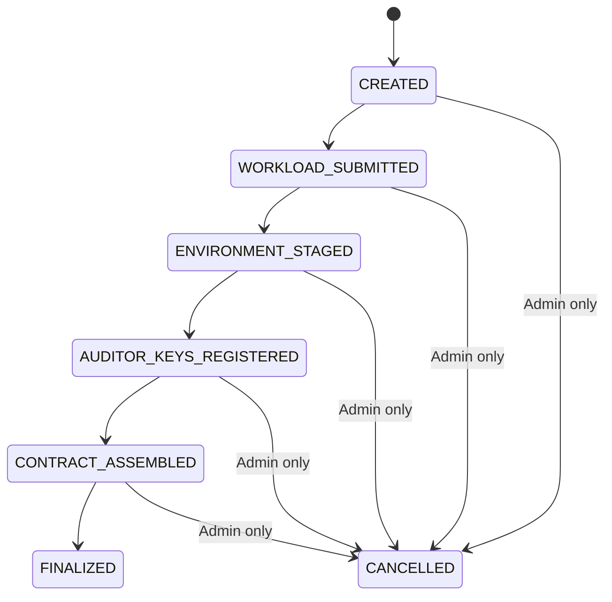

# HPCR Contract Builder — High-Level Design (HLD)

> **Version:** 0.3  
> **Date:** 2026-02-23  
> **Status:** Draft

---

## 1. Introduction

The HPCR Contract Builder is a self-hosted, open-source system that enables organizations to collaboratively construct, sign, and finalize encrypted userdata contracts (YAML format) for **HPCR**, **HPCR4RHVS**, and **HPCC** deployments.

The system enforces a strict, linear, multi-persona workflow. Each persona contributes exactly once per build. Once finalized, the contract becomes immutable.

### Architectural Principles

- All cryptographic operations are executed locally on the **Flutter desktop application**.
- The backend **never** performs encryption, signing, or contract assembly.
- The backend only orchestrates workflow, verifies signatures, stores encrypted artifacts, and maintains an audit hash chain.
- The final artifact is a signed and encrypted YAML contract file.

---

## 2. Goals & Non-Goals

### Goals

- Enforce separation of duties across personas
- Ensure strict linear state progression
- Maintain cryptographic audit trail
- Keep private keys client-side only
- Protect sensitive data at every stage
- Produce immutable final YAML contract
- Support LAN and internet deployments
- Fully open-source stack

### Non-Goals

- Multi-tenant SaaS
- Centralized key management
- Real-time collaboration
- HPCR orchestration

---

## 3. System Context

### Customer Environment

```
[ Flutter Desktop App ]  <--HTTPS-->  [ nginx Reverse Proxy ]
                                              |
                                              v
                                        [ Go Backend ]
                                              |
                                              v
                                        [ PostgreSQL ]
```

### Deployment Target

```
[ HPCR Instance ]  <-- receives YAML userdata file
```

### Key Points

- nginx is **mandatory** for TLS termination.
- Backend is never directly internet-exposed.
- All crypto operations occur locally.
- Backend stores only encrypted or hashed data.
- Contract CLI (using Contract Go) is used in the desktop application.

---

## 4. Personas & Responsibilities

### Solution Provider

| | |
|---|---|
| **Provides** | Workload definition, Encryption certificate |
| **Local Actions** | Encrypt workload using `contract-cli` (via `contract-go`), Compute SHA256 hash of encrypted workload, Sign hash |
| **Uploads** | `workload.enc`, `section_hash`, `signature` |

---

### Data Owner

| | |
|---|---|
| **Provides** | Logging credentials and environment configuration |
| **Constraint** | The environment section cannot be fully encrypted until auditor provides attestation and signing details. |

**Local Actions:**

1. Generate environment section (plaintext locally).
2. Generate random symmetric key (per build).
3. Encrypt environment section using symmetric key.
4. Encrypt symmetric key using a temporary build public key.
5. Compute SHA256 hash of encrypted env payload.
6. Sign hash.

**Uploads:** `encrypted_env_payload`, `encrypted_symmetric_key`, `section_hash`, `signature`

**Result:** Environment section is securely staged but not finalized.

---

### Auditor

| | |
|---|---|
| **Provides** | Attestation public key, Signing key/cert |

**Local Actions:**

1. Generate attestation key pair locally.
2. Generate signing key/cert locally.
3. Register attestation public key + signing cert with backend.
4. Download: `workload.enc`, `encrypted_env_payload`, `encrypted_symmetric_key`
5. Decrypt symmetric key locally.
6. Decrypt staged environment section.
7. Perform final encryption of environment using `contract-cli`.
8. Assemble final YAML contract.
9. Compute: `contract_hash = SHA256(contract.yaml)`
10. Sign `contract_hash`.
11. Upload: `contract.yaml`, `contract_hash`, `signature`

**Backend Actions:**

- Verifies signature.
- Stores `contract.yaml`.
- Marks build as **FINALIZED**.
- Emits audit event.

---

### Env Operator

- Downloads finalized YAML contract.
- Deploys to HPCR instance.
- **No cryptographic operations performed.**

---

### Admin

- Creates users
- Assigns roles
- Cancels pre-finalized builds

---

### Viewer

- Read-only access to builds and audit logs.

---

## 5. Build Lifecycle



### Invariants

- Strict linear progression.
- Each persona contributes once.
- No concurrent edits.
- **FINALIZED** builds are immutable.
- Backend performs no contract assembly.

---

## 6. Core Domain Model

### Build

| Field | Type |
|---|---|
| `id` | UUID |
| `name` | string |
| `status` | ENUM |
| `created_by` | reference |
| `created_at` | timestamp |
| `finalized_at` | timestamp |
| `contract_hash` | string |
| `contract_yaml` | bytea |
| `is_immutable` | bool |

### Build Section

| Field | Type |
|---|---|
| `id` | UUID |
| `build_id` | reference |
| `persona_role` | ENUM |
| `submitted_by` | reference |
| `encrypted_payload` | bytea |
| `encrypted_symmetric_key` | bytea (nullable) |
| `section_hash` | string |
| `submitted_at` | timestamp |

### Audit Event

| Field | Type |
|---|---|
| `id` | UUID |
| `build_id` | reference |
| `sequence_no` | integer |
| `event_type` | ENUM |
| `actor_user_id` | reference |
| `actor_public_key` | string |
| `ip_address` | string |
| `device_metadata` | JSON |
| `event_data` | JSON |
| `previous_event_hash` | string |
| `event_hash` | string |
| `signature` | string |
| `created_at` | timestamp |

### User

| Field | Type |
|---|---|
| `id` | UUID |
| `name` | string |
| `email` | string |
| `password_hash` | string |
| `is_active` | bool |
| `created_at` | timestamp |

### User Role

| Field | Type |
|---|---|
| `user_id` | reference |
| `role` | ENUM |
| `assigned_by` | reference |
| `assigned_at` | timestamp |

### API Token

| Field | Type |
|---|---|
| `id` | UUID |
| `user_id` | reference |
| `name` | string |
| `token_hash` | string |
| `last_used_at` | timestamp |
| `revoked_at` | timestamp (nullable) |
| `created_at` | timestamp |

---

## 7. Audit Hash Chain

For each build, events form a tamper-evident hash chain:

```
Event[0]:
  previous_event_hash = SHA256("IBM_CC:" + build_id)
  event_hash = SHA256(canonical_json(event_data) + previous_event_hash)

Event[N]:
  previous_event_hash = Event[N-1].event_hash
  event_hash = SHA256(canonical_json(event_data) + previous_event_hash)
```

- All persona-triggered events include: `signature = sign(event_hash)`

**Verification endpoint:**

- Recomputes hash chain
- Verifies all signatures
- Validates `contract_hash`

---

## 8. API Surface

### Auth

| Method | Endpoint |
|---|---|
| `POST` | `/auth/login` |
| `POST` | `/auth/logout` |

### Users

| Method | Endpoint |
|---|---|
| `GET` | `/users` |
| `POST` | `/users` |
| `PATCH` | `/users/{id}/roles` |
| `GET` | `/users/{id}/tokens` |
| `POST` | `/users/{id}/tokens` |
| `DELETE` | `/users/{id}/tokens/{token_id}` |

### Builds

| Method | Endpoint |
|---|---|
| `GET` | `/builds` |
| `POST` | `/builds` |
| `GET` | `/builds/{id}` |
| `DELETE` | `/builds/{id}` |

### Sections

| Method | Endpoint |
|---|---|
| `POST` | `/builds/{id}/workload` |
| `POST` | `/builds/{id}/environment` |
| `POST` | `/builds/{id}/attestation` |
| `POST` | `/builds/{id}/finalize` |

### Audit & Export

| Method | Endpoint |
|---|---|
| `GET` | `/builds/{id}/audit` |
| `GET` | `/builds/{id}/verify` |
| `GET` | `/builds/{id}/export` |
| `GET` | `/builds/{id}/userdata` |

---

## 9. System Architecture

### Reverse Proxy (Mandatory: nginx)

**Responsibilities:**

- TLS 1.3 termination
- Rate limiting
- Request body size limits
- Security headers
- Optional IP allowlisting

### Backend (Go)

**Components:**

- HTTP Layer
- `BuildService` (state machine enforcement)
- `AuditService`
- `VerificationService`
- `ExportService`
- `UserService`
- Repository Layer (`sqlc` + `pgx`)

### Database

- PostgreSQL 16

---

## 10. Security Design

| Category | Details |
|---|---|
| **Transport Security** | TLS 1.3 via nginx |
| **Authentication** | Bearer tokens (stored hashed) |
| **Authorization** | Strict server-side RBAC |
| **Private Key Isolation** | All private keys generated and stored locally; never transmitted |
| **Environment Staging Protection** | Encrypted locally before upload; symmetric key encrypted with temporary build public key |
| **Final Contract Integrity** | SHA256 hash + signature; immutable after FINALIZED |
| **Audit Integrity** | Deterministic hash chain; signature verification per event |
| **Data at Rest** | Only encrypted payloads stored; disk-level encryption recommended |

---

## 11. Deployment Topology

```
[ Desktop App ]
       |
       v
[ nginx Reverse Proxy ]
       |
       v
[ Go Backend ]
       |
       v
[ PostgreSQL ]
```

- Single binary backend.
- Docker Compose or bare metal deployment supported.

---

## 12. Summary of v0.3 Changes

- Introduced secure **ENVIRONMENT_STAGED** phase
- Added temporary symmetric encryption for env section
- Auditor performs final env encryption
- Lifecycle updated accordingly
- Backend remains crypto-neutral
- Contract remains YAML-based
- Stronger separation of duties enforced

---

> *End of HPCR Contract Builder HLD v0.3*
