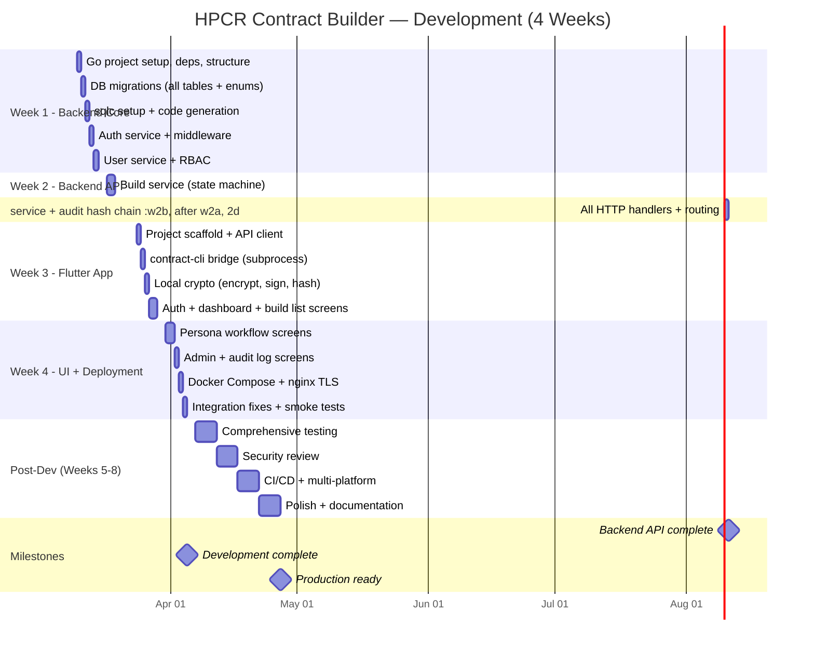

# HPCR Contract Builder — Project Timeline

> **Version:** 0.3  
> **Date:** 2026-03-03  
> **Status:** Draft  
> **Prepared for:** Product Management Review

---

## Executive Summary

The HPCR Contract Builder will be developed by a **single developer over 4 weeks** (March 10 – April 4, 2026). This period covers **development only** — all features including the complete Go backend, Flutter desktop app, Docker deployment, and nginx configuration. Testing, QA, security review, and CI/CD follow in a separate post-development phase.

> [!IMPORTANT]
> The 1-month window is for **development only**. Testing, security hardening, and CI/CD are planned for the post-development phase.

---

## Development Scope (Weeks 1–4)

- Go backend with all API endpoints
- PostgreSQL schema with migrations
- Build state machine (full lifecycle)
- Audit hash chain (create + verify)
- Bearer token authentication + RBAC
- Flutter desktop app with all workflow screens
- Admin screens (user management, role assignment)
- contract-cli integration (subprocess)
- Local crypto operations (encrypt, sign, hash)
- Docker Compose deployment
- nginx reverse proxy with TLS
- Basic inline tests during development

### Post-Development (Weeks 5–8)

- Comprehensive test suite (unit, integration, E2E)
- Security hardening review
- CI/CD pipeline
- Multi-platform testing (macOS, Linux, Windows)
- UI polish, animations, and edge-case error handling
- Documentation & deployment guide

---

## 4-Week Development Timeline

---

## Week-by-Week Breakdown

### Week 1 — Backend Core (Mar 10–14)

| Day | Task | Deliverable |
|---|---|---|
| Mon | Go module init, directory structure, dependencies | Buildable skeleton |
| Tue | Write all 5 migration files (enums + tables) | Running DB schema |
| Wed | sqlc config, SQL queries, code generation | Type-safe repository layer |
| Thu | Auth service (login, logout, token hashing, bcrypt) + auth middleware | Working auth flow |
| Fri | User service (CRUD, roles, tokens) + RBAC middleware | User management |

**Exit Criteria:** Backend builds, DB schema is up, auth works end-to-end.

---

### Week 2 — Backend API (Mar 17–21)

| Day | Task | Deliverable |
|---|---|---|
| Mon–Tue | Build service: state machine, transition validation, section storage | Core build lifecycle |
| Wed–Thu | Section service (all 4 submissions) + audit hash chain service | Persona workflow + audit trail |
| Fri | HTTP handlers for all endpoints, router setup, verification & export | Complete API surface |

**Exit Criteria:** All API endpoints testable via curl. Build lifecycle works end-to-end.

---

### Week 3 — Flutter Desktop App (Mar 24–28)

| Day | Task | Deliverable |
|---|---|---|
| Mon | Flutter project scaffold, Dio API client, models, routing | Connected desktop app |
| Tue | contract-cli subprocess bridge | Workload/env encryption |
| Wed | Local crypto: AES-256, RSA, SHA256, signing | Client-side security |
| Thu–Fri | Login, dashboard, build list, build detail screens | Core navigation UI |

**Exit Criteria:** Desktop app connects to backend, can login and view builds.

---

### Week 4 — UI Completion & Deployment (Mar 31–Apr 4)

| Day | Task | Deliverable |
|---|---|---|
| Mon–Tue | Persona workflow screens (workload, environment, auditor, finalize) | Full submission flow |
| Wed | Admin screens (user management, role assignment) + audit log viewer | Complete UI |
| Thu | Docker Compose setup + nginx reverse proxy with TLS | Production-like deployment |
| Fri | Integration fixes, smoke tests, dev handoff notes | Development complete |

**Exit Criteria:** All features developed. Full build lifecycle works through the UI. Docker Compose + nginx boots the system.

---

## Key Milestones

| Milestone | Date | Description |
|---|---|---|
| **M1: Backend API Complete** | Mar 21 (end of Week 2) | All endpoints functional, testable via curl |
| **M2: Development Complete** | Apr 4 (end of Week 4) | All features built, integrated, and deployable |
| **M3: Production Ready** | May 2 (end of Week 8) | Tested, hardened, CI/CD in place |

---

## Post-Development Phase (Weeks 5–8)

| Week | Focus | Scope |
|---|---|---|
| Week 5 | Comprehensive testing | Unit tests (state machine, hash chain), integration tests (DB), API E2E tests |
| Week 6 | Security review | Crypto audit, input validation, rate limiting, penetration testing |
| Week 7 | CI/CD & multi-platform | Pipeline setup, cross-platform builds (macOS, Linux, Windows) |
| Week 8 | Polish & documentation | UI polish, error handling improvements, deployment guide, user documentation |

---

## Risks

| Risk | Impact | Mitigation |
|---|---|---|
| contract-cli integration issues | Week 3 delay | Start with mock crypto in Week 2; integrate real CLI in Week 3 |
| Crypto operations complexity | Week 3–4 delay | Use well-documented Dart packages (`pointycastle`, `crypto`) |
| Scope creep | Miss deadline | Strict MVP scope — defer all non-critical features |
| Unforeseen bugs in Week 4 | Unstable release | Keep Friday as buffer; cut audit log UI if needed |

---

## Assumptions

- Single full-time developer, 5 days/week
- Development start date: March 10, 2026
- Post-development phase starts: April 7, 2026
- `contract-go` / `contract-cli` binary is available
- Primary development on macOS

---

> *End of HPCR Contract Builder Timeline v0.3*
